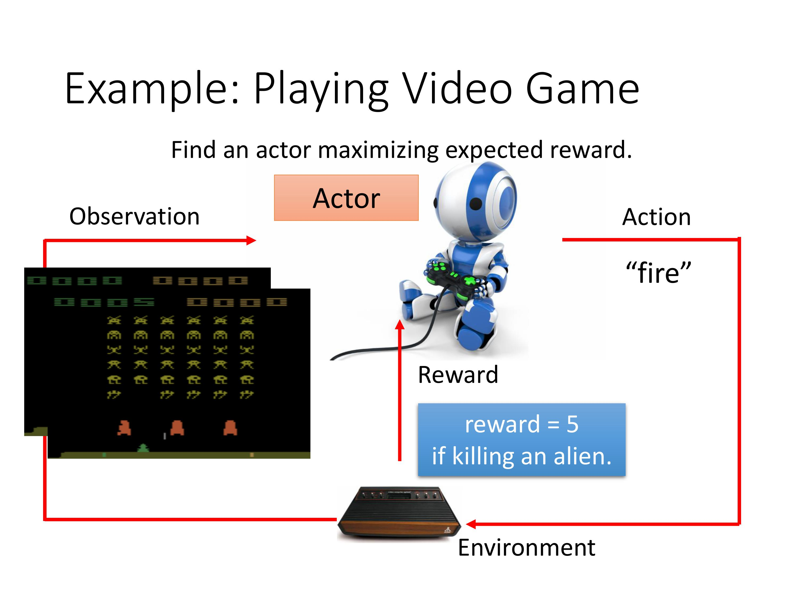

## 课程

0:06    好 那我們來上課吧 那這一堂課啊 我們要講的是

0:12    Deep Reinforcement Learning 也就是 RL 那我想這個 RL 啊

0:18    Reinforcement Learning 啊 大家一定一點都不陌生 因為你知道很多很潮的應用

0:24    AlphaGo 等等 它背後呢 用的就是 RL 的技術 那 RL 可以講的技術啊

0:31    非常非常地多 它不是在一堂課裡面可以講得完的 我甚至覺得說

0:37    如果有人要把它開成一整個學期的課 可能也是有這麼多東西可以講

0:43    所以今天啊 這堂課的目的 並不是要告訴你有關 RL 的一切

0:48    而是讓大家有一個基本的認識 大概知道 RL 是什麼樣的東西

0:55    那 RL 相關的課程 你其實在網路上可以找到 非常非常多的參考的資料

1:01    那 RL 如果要講得非常地艱澀 其實也是可以講得非常地艱澀的 可是今天這一堂課啊

1:08    我們儘量避開太過理論的部分 我期待這堂課可以讓你做到的

1:14    並不是讓你聽了覺得 哇 RL 很困難啊 搞不清楚在做什麼 而是期待讓你覺得說

1:20    啊 RL 原來就只是這樣而已 我自己應該也做得起來 希望這一堂課可以達到這一個目的

1:29    好 那什麼是 Reinforcement Learning 呢 到目前為止啊 我們講的幾乎都是 Supervised Learning

1:37    假設你要做一個 Image 的 Classifier 你不只要告訴機器 它的 Input 是什麼 你還要告訴機器

1:43    它應該輸出什麼樣的 Output 然後接下來呢 你就可以 Train 一個 Image 的 Classifier

1:50    那在多數這門課講到目前為止的技術 基本上都是基於 Supervised Learning 的方法

1:56    就算是我們在講 Self Supervised Learning 的時候 我們其實也是

2:02    很類似 Supervised Learning 的方法 只是我們的 Label 不需要特別僱用人力去標記

2:09    它可以自動產生 或者是我們在講 Auto-encoder 的時候 我們雖然說它是一個 Unsupervised 的方法

2:16    我們沒有用到人類的標記 但事實上 我們還是有一個 Label

2:21    只是這個 Label 不需要耗費人類的力量來產生而已 好 但是 RL 就是另外一個面向的問題了

2:30    在 RL 裡面 我們遇到的問題是這樣子的 我們 機器當我們給它一個輸入的時候

2:37    我們不知道最佳的輸出應該是什麼 舉例來說

2:42    假設你要叫機器學習下圍棋 用 Supervised Learning 的方法 好像也可以做

2:48    你就是告訴機器說 看到現在的盤勢長這個樣子的時候 下一步應該落子的位置在哪裡

2:56    但是問題是 下一步應該落子的位置到底應該在哪裡呢 哪一個是最好的下一步呢

3:03    哪一步是神之一手呢 可能人類根本就不知道

3:08    當然你可以說 讓機器閱讀很多職業棋士的棋譜 讓機器閱讀很多高段棋士的棋譜

3:16    也許這些棋譜裡面的答案 也許這些棋譜裡面給某一個盤勢 人類下的下一步

3:22    就是一個很好的答案 但它是不是最好的答案呢 我們不知道

3:28    在這個你不知道正確答案是什麼的情況下 往往就是 RL 可以派上用場的時候

3:35    所以當你今天 你發現你要蒐集有標註的資料很困難的時候

3:40    正確答案人類也不知道是什麼的時候 也許就是你可以考慮使用 RL 的時候

3:48    但是 RL 在學習的時候 機器其實也不是一無所知的 我們雖然不知道正確的答案是什麼

3:55    但是機器會知道什麼是好 什麼是不好 機器會跟環境去做互動

4:00    得到一個叫做 Reward 的東西 這我們等一下都還會再細講 所以機器會知道 它現在的輸出是好的還是不好的

4:08    來藉由跟環境的互動 藉由知道什麼樣的輸出是好的 什麼樣的輸出是不好的

4:13    機器還是可以學出一個模型 好 那接下來呢 這是今天這份投影片的 Outline

4:20    首先呢 我們會從最基本的 RL 的概念開始 那在介紹這個 RL 概念的時候

4:27    有很多不同的切入點啦 也許你比較常聽過的切入點是這樣

4:33    比如說從 Markov Decision Process 開始講起 那我們這邊選擇了一個比較不一樣的切入點

4:39    我要告訴你說 雖然如果你自己讀 RL 的文獻的話 你會覺得 哇 RL 很複雜哦

4:45    跟一般的 Machine Learning 好像不太一樣哦 但是我這邊要告訴你說 RL 它跟我們這一門課學的 Machine Learning

4:53    是一樣的框架 我們在今天這個這學期 一開始的第一堂課就告訴你說

4:59    Machine Learning 就是三個步驟 那 RL 呢 RL 也是一模一樣的三個步驟

5:07    等一下會再跟大家說明 好 在今天 在這個本學期這一門課的第一開始

5:14    就告訴你說 什麼是機器學習 機器學習就是找一個 Function

5:21    Reinforcement Learning RL 也是機器學習的一種 那它也在找一個 Function

5:27    它在找什麼樣的 Function 呢 那 Reinforcement Learning 裡面呢

5:32    我們會有一個 Actor 還有一個 Environment 那這個 Actor 跟 Environment

5:39    會進行互動 你的這個 Environment 你的這個環境啊 會給 Actor 一個 Observation

5:46    會給 那這個 Observation 呢 就是 Actor 的輸入 那 Actor 呢

5:51    看到這個 Observation 以後呢 它會有一個輸出 這個輸出呢

5:56    叫做 Action 那這個 Action 呢 會去影響 Environment

6:02    這個 Actor 採取 Action 以後呢 Environment 就會給予新的 Observation 然後 Actor 呢

6:07    會給予新的 Action 那這個 Observation 是 Actor 的輸入 那這個 Action 呢

6:13    是 Actor 的輸出 所以 Actor 本身啊 它就是一個 Function

6:19    其實 Actor 它就是我們要找的 Function 這個 Function 它的輪入 就是環境給它的 Observation

6:26    輸出就是這個 Actor 要採取的 Action 而今天在這個互動的過程中呢

6:32    這個 Environment 會不斷地給這個 Actor 一些 Reward 告訴它說

6:37    你現在採取的這個 Action 它是好的還是不好的 而我們今天要找的這個 Actor

6:44    我們今天要找的這個 Function 可以拿 Observation 當作 Input Actor 當作 Output 的 Function 這個 Function 的目標

6:50    是要去 Maximizing 我們可以從 Environment 獲得到的 Reward 的總和

6:57    我們希望呢 找一個 Function 那用這個 Function 去跟環境做互動

7:02    用 Observation 當作 Input 輸出 Action 最終得到的 Reward 的總和 可以是最大的

7:09    這個就是 RL 要找的 Function 那我知道這樣講 你可能還是覺得有些抽象

7:15    所以我們舉更具體的例子 那等一下舉的例子呢 都是用 Space Invader 當作例子啦

7:23    那 Space Invader 就是一個非常簡單的小遊戲 那 RL 呢

7:28    最早的幾篇論文 也都是玩 讓那個機器呢 去玩這個 Space Invader 這個遊戲

7:34    在 Space Invader 裡面呢 你要操控的是下面這個綠色的東西 這個下面這個綠色的東西呢

7:40    是你的太空梭 你可以採取的行為 也就是 Action 呢 有三個 左移 右移跟開火

7:47    就這三個行為 然後你現在要做的事情啊 就是殺掉畫面上的這些外星人

7:54    畫面上這些黃色的東西 也就是外星人啦 然後你開火 擊中那些外星人的話

8:00    那外星人就死掉了 那前面這些東西是什麼呢 那個是你的防護罩

8:06    如果你不小心打到自己的防護罩的話 你的防護罩呢 也是會被打掉的 那你可以躲在防護罩後面

8:12    你就可以擋住外星人的攻擊 然後接下來呢 會有分數

8:17    那在螢幕畫面上會有分數 當你殺死外星人的時候 你會得到分數 或者是在有些版本的 Space Invader 裡面

8:24    會有一個補給包 從上面橫過去 飛過去 那你打到補給包的話 會被加一個很高的分數

8:31    那這個 Score 呢 就是 Reward 就是環境給我們的 Reward

8:37    好 那這個遊戲呢 它是會終止的 那什麼時候終止呢 當所有的外星人都被殺光的時候就終止

8:44    或者是呢 外星人其實也會對你的母艦開火啦 外星人擊中你的母艦 你也是會

8:51    這個你就被摧毀了 那這個遊戲呢 也就終止了 好 那這個是介紹一下

8:56    Space Invader 這一個遊戲 好 那如果你今天呢 要用 Actor 去玩 Space Invader

9:03    大概會像是什麼樣子呢 現在你的 Actor 啊 Actor 雖然是一個機器 但是它是坐在人的這一個位置

9:11    它是站在人這一個角度 去操控搖桿 去控制那個母艦

9:17    去跟外星人對抗 而你的環境是什麼 你的環境呢

9:22    是遊戲的主機 遊戲的主機這邊去操控那些外星人 外星人去攻擊你的母艦

9:30    所以 Observation 是遊戲的畫面 所以對 Actor 來說

9:35    它看到的 其實就跟人類在玩遊戲的時候 看到的東西是一樣的 就看到一個遊戲的畫面

9:41    那輸出呢 就是 Actor 可以採取的行為 那可以採取哪些行為 通常是事先定義好的

9:47    在這個遊戲裡面 就只有向左 向右跟開火 三種可能的行為而已

9:53    好 那當你的 Actor 採取向右這個行為的時候 那它會得到 Reward

9:58    那因為在這個遊戲裡面 只有殺掉外星人會得到分數 而我們就是把分數定義成我們的 Reward

10:05   那向左 向右其實並不會 不可能殺掉任何的外星人 所以你得到的 Reward 呢 就是 0 分

10:12   好 那你採取一個 Action 以後呢 遊戲的畫面就變了 遊戲的畫面變的時候

10:18   就代表了有了新的 Observation 進來 有了新的 Observation 進來 你的 Actor 就會決定採取新的 Action

10:24   你的 Actor 是一個 Function 這個 Function 會根據輸入的 Observation 輸出對應的 Action

10:30   那新的畫面進來 假設你的 Actor 現在它採取的行為是開火 而開火這個行為正好殺掉一隻外星人的時候

10:37   你就會得到分數 那這邊假設得到的分數是 5 分 殺那個外星人 得到的分數是 5 分

10:43   那你就得到 Reward 等於 5 那這個呢 就是拿 Actor 去玩

10:49   玩這個 Space Invader 這個遊戲的狀況 好 那這個 Actor 呢

10:55   它想要學習的是什麼呢 我們在玩遊戲的過程中 會不斷地得到 Reward

11:00   那在剛才例子裡面 做第一個行為的時候 向右的時候得到的是 0 分 做第二個行為

11:06   開火的時候得到的是 5 分 那接下來你採取了一連串行為 都有可能給你分數

11:11   而 Actor 要做的事情 我們要學習的目標 我們要找的這個 Actor 就是

11:17   我們想要 Learn 出一個 Actor 這個 Actor 這個 Function 我們使用它在這個遊戲裡面的時候

11:23   可以讓我們得到的 Reward 的總和會是最大的

11:28   那這個就是拿 Actor 去 這個就是 RL 用在玩這個小遊戲裡面的時候

11:36   做的事情 好 那其實如果把 RL 拿來玩圍棋 拿來下圍棋

11:42   其實做的事情跟小遊戲 其實也沒有那麼大的差別 只是規模跟問題的複雜度不太一樣而已

11:50   那如果今天你要讓機器來下圍棋 那你的 Actor 就是就是 AlphaGo

11:56   那你的環境是什麼 你的環境就是 AlphaGo 的人類對手

12:01   那 AlphaGo 的輸入是什麼 你的這個 Actor 的輸入是什麼 你的 Actor 的輸入就是棋盤

12:08   棋盤上黑子跟白子的位置 那如果是在遊戲的一開始 棋盤上就空空的

12:15   空空如也 上面什麼都沒有 沒有任何黑子跟白子 那這個 Actor 呢

12:20   看到這個棋盤呢 它就要產生輸出 它就要決定它下一步

12:26   應該落子在哪裡 那如果是圍棋的話 你的輸出的可能性就是有 19×19 個可能性

12:33   那這 19×19 個可能性 每一個可能性 就對應到棋盤上的一個位置

12:39   好 那假設現在你的 Actor 決定要落子在這個地方 那這一個結果 就會輸入給你的環境

12:47   那其實就是一個棋士 然後呢 這個環境呢 就會再產生新的 Observation

12:55   因為這個李世石這個棋士呢 也會再落一子 那現在看到的環境又不一樣了

13:01   那你的 Actor 看到這個新的 Observation 它就會產生新的 Action

13:06   然後就這樣反覆繼續下去 你就可以讓機器做下圍棋這件事情

13:12   好 那在這個 在這個下圍棋這件事情裡面的 Reward 是怎麼計算的呢

13:18   在下圍棋裡面 你所採取的行為 幾乎都沒有辦法得到任何 Reward

13:24   在下圍棋這個遊戲裡 在下圍棋這件事情裡面呢 你會定義說 如果贏了

13:31   就得到 1 分 如果輸了就得到 -1 分 也就是說在下圍棋這整個

13:38   這個你的 Actor 跟環境互動的過程中 其實只有遊戲結束

13:44   只有整場圍棋結束的最後一子 你才能夠拿到 Reward 就你最後

13:50   最後 Actor 下一子下去 贏了 就得到 1 分 那最後它落了那一子以後

13:56   遊戲結束了 它輸了 那就得到 -1 分 那在中間整個互動的過程中的 Reward

14:02   就都算是 0 分 沒有任何的 Reward 那這個 Actor 學習的目標啊

14:07   就是要去最大化 它可能可以得到的 Reward

14:13   好 剛才講的也許你都已經聽過了 那這個是 RL 最常見的一種解說方式

14:19   那接下來要告訴你說 RL 跟機器學習的 Framework

14:24   它們之間的關係是什麼 開學第一堂課就告訴你說 Machine Learning 就是三個步驟

14:32   第一個步驟 你有一個 Function 那個 Function 裡面有一些未知數

14:37   Unknown 的 Variable 這些未知數是要被找出來的 第二步 訂一個 Loss Function

14:44   第三步 想辦法找出未知數去最小化你的 Loss

14:50   第三步就是 Optimization 而 RL 其實也是一模一樣的三個步驟

14:57   我們先來看第一個步驟 第一個步驟 我們現在有未知數的這個 Function

15:03   到底是什麼呢 這個有未知數的 Function 就是我們的 Actor

15:08   那在 RL 裡面 你的 Actor 呢 就是一個 Network 那我們現在通常叫它 Policy 的 Network

15:16   那在過去啊 在還沒有把 Deep Learning 用到 RL 的時候 通常你的 Actor 是比較簡單的

15:22   它不是 Network 它可能只是一個 Look-Up-Table 告訴你說看到什麼樣的輸入 就產生什麼樣的輸出

15:27   那今天我們都知道要用 Network 來當做這個 Actor 那這個 Network 其實就是一個很複雜的 Function

15:34   這個複雜的 Function 它的輸入是什麼呢 它的輸入就是遊戲的畫面

15:40   就是遊戲的畫面 這個遊戲上面 這個黑子跟這個 這個不是下圍棋啦

15:46   所以沒有黑子跟白子啊 那這裡面如果是拿這個 玩 Space Invader 當作例子的話呢

15:52   這個遊戲畫面上的 Pixel 像素 就是這一個 Actor 的輸入

15:58   那它的輸出是什麼呢 它的輸出就是 每一個可以採取的行為

16:05   它的分數 每一個可以採取的 Action 它的分數 舉例來說 輸入這樣的畫面

16:11   給你的 Actor 你的 Actor 其實就是一個 Network 它的輸出可能就是給 向左 0.7 分

16:17   向右 0.2 分 開火 0.1 分 那事實上啊

16:22   這件事情跟分類是沒有什麼兩樣的 你知道分類就是輸入一張圖片

16:28   輸出就是決定這張圖片是哪一個類別 那你的 Network 會給每一個類別 一個分數

16:34   你可能會通過一個 Softmax Layer 然後每一個類別都有個分數 而且這些分數的總和是 1

16:39   那其實在 RL 裡面 你的 Actor 你的 Policy Network 跟分類的那個 Network

16:44   其實是一模一樣的 你就是輸入一張圖片 輸出其實最後你也會有個 Softmax Layer

16:49   然後呢 你就會 Left、Right 跟 Fire 三個 Action 各給一個分數 那這些分數的總和

16:55   你也會讓它是 1 那至於這個 Network 的架構呢 那你就可以自己設計了

17:01   要設計怎麼樣都行 比如說如果輸入是一張圖片 欸 也許你就會想要用 CNN 來處理

17:09   不過在助教的程式裡面 其實不是用 CNN 來處理啦 因為在我們的作業裡面 其實在玩遊戲的時候

17:14   不是直接讓我們的 Machine 去看遊戲的畫面 讓它直接去看遊戲的 讓它直接去看遊戲的畫面比較難做啦

17:21   所以我們是讓 看這個跟現在遊戲的狀況有關的一些參數而已

17:27   所以在這個助教的 在這個作業的這個 Sample Code 裡面呢 還沒有用到 CNN 那麼複雜

17:34   就是一個簡單的 Fully Connected Network 但是假設你要讓你的 Actor 它的輸入真的是遊戲畫面

17:40   欸 那你可能就會採取這個 CNN 你可能就用 CNN 當作你的 Network 的架構

17:46   甚至你可能說 我不要只看現在這一個時間點的遊戲畫面 我要看整場遊戲到目前為止發生的所有事情

17:54   可不可以呢 可以 那過去你可能會用 RNN 考慮 現在的畫面跟過去所有的畫面

18:01   那現在你可能會想要用 Transformer 考慮所有發生過的事情 所以 Network 的架構是你可以自己設計的

18:08   只要能夠輸入遊戲的畫面 輸出類似像類別這樣的 Action 就可以了

18:16   那最後機器會決定採取哪一個 Action 取決於每一個 Action 取得的分數

18:23   常見的做法啊 是直接把這個分數 就當做一個機率 然後按照這個機率

18:30   去 Sample 去隨機決定要採取哪一個 Action 舉例來說 在這個例子裡面

18:35   向左得到 0.7 分 那就是有 70% 的機率會採取向左

18:41   20% 的機率會採取向右 10% 的機率會採取開火

18:46   那你可能會問說 為什麼不是用（00：18：47）呢 為什麼不是看 Left 的分數最高

18:51   就直接向左呢 你也可以這麼做

18:56   但是在助教的程式裡面 還有多數 RL 應用的時候 你會發現 我們都是採取 Sample

19:03   採取 Sample 有一個好處是說 今天就算是看到同樣的遊戲畫面 你的機器每一次採取的行為

19:09   也會略有不同 那在很多的遊戲裡面這種隨機性 也許是重要的

19:14   比如說你在做剪刀石頭布的時候 如果你總是會出石頭 就跟小叮噹一樣 那你就很容易被打爆

19:20   如果你有一些隨機性 就比較不容易被打爆 那其實之所以今天的輸出

19:26   是用隨機 Sample 的 還有另外一個很重要的理由 那這個我們等一下會再講到

19:32   好 所以這是第一步 我們有一個 Function 這個 Function 有 Unknown 的 Variable 我們有一個 Network

19:38   那裡面有參數 這個參數就是 Unknown 的 Variable 就是要被學出來的東西

> 用sample，而不是直接取最高分，有2个原因：
>
> 1. 你總是會出石頭 就跟小叮噹一樣 那你就很容易被打爆
> 2. 这节课没找到，应该是下节课讲到的探索和利用，随机性增大探索（YES!）
>
> 原文是: " 假設有一些 Action 從來沒被執行過 那你根本就無從知道 這個 Action 好或不好"

19:44   這是第一步 然後接下來第二步 我們要定義 Loss 在 RL 裡面

19:49   我們的 Loss 長得是什麼樣子呢 我們再重新來看一下 我們的機器跟環境互動的過程

19:57   那只是現在用不一樣的方法 來表示剛才說過的事情 好 首先有一個初始的遊戲畫面

20:05   這個初始的遊戲畫面 被作為你的 Actor 的輸入 你的 Actor 那就輸出了一個 Action

20:12   比如說向右 輸入的遊戲畫面呢 我們叫它 s1 然後輸出的 Action 呢

20:17   就叫它 a1 那現在會得到一個 Reward 這邊因為向右沒有做任何事情

20:23   沒有殺死任何的外星人 所以得到的 Reward 可能就是 0 分 採取向右以後 會看到新的遊戲畫面

20:30   這個叫做 s2 根據新的遊戲畫面 s2 你的 Actor 會採取新的行為

20:35   比如說開火 這邊用 a2 來表示看到遊戲畫面 s2 的時候 所採取的行為

20:42   那假設開火恰好殺死一隻外星人 和你的 Actor 就得到 Reward 這個 Reward 的分數呢

20:48   是 5 分 然後採取開火這個行為以後 接下來你會看到新的遊戲畫面

20:54   那機器又會採取新的行為 那這個互動的過程呢 就會反覆持續下去

21:01   直到機器在採取某一個行為以後 遊戲結束了 那什麼時候遊戲結束呢

21:07   就看你遊戲結束的條件是什麼嘛 舉例來說 採取最後一個行為以後 比如說向右移

21:13   正好被外星人的子彈打中 那你的飛船就毀了 那遊戲就結束了

21:19   或者是最後一個行為是開火 把最後一隻外星人殺掉 那遊戲也就結束了

21:25   就你執行某一個行為 滿足遊戲結束的條件以後 遊戲就結束了

21:31   那從遊戲開始到結束的這整個過程啊 被稱之為一個 Episode

21:37   那在整個遊戲的過程中 機器會採取非常多的行為 每一個行為都可能得到 Reward

21:45   把所有的 Reward 通通集合起來 我們就得到一個東西 叫做整場遊戲的 Total Reward

21:53   好 那這個 Total Reward 呢 就是從遊戲一開始得到的 r1 一直得 一直加 累加到遊戲最後結束的時候

22:00   得到的 rt 假設這個遊戲裡面會互動 T 次 那麼就得到一個 Total Reward

22:06   我們這邊用 R 來表示 Total Reward 其實這個 Total Reward 又有另外一個名字啊

22:12   叫做 Return 啦 你在這個 RL 的文獻上 常常會同時看到 Reward 跟 Return

22:18   這兩個詞會出現 那 Reward 跟 Return 其實有點不一樣 Reward 指的是你採取某一個行為的時候

22:25   立即得到的好處 這個是 Reward 把整場遊戲裡面所有的 Reward 通通加起來

22:31   這個叫做 Return 但是我知道說 很快你就會忘記 Reward 跟 Return 的差別了

22:36   所以我們等一下就不要再用 Return 這個詞彙 我們直接告訴你說 整場遊戲的 Reward 的總和

22:42   就是 Total 的 Reward 而這個 Total 的 Reward 啊 就是我們想要去最大化的東西

22:49   就是我們訓練的目標 那你可能會說 欸 這個跟 Loss 不一樣啊

22:55   Loss 是要越小越好啊 這個 Total Reward 是要越大越好啊 所以有點不一樣吧

23:01   但是我們可以說在 RL 的這個情境下 我們把那個 Total Reward 的負號

23:09   負的 Total Reward 就當做我們的 Loss Total Reward 是要越大越好

23:14   那負的 Total Reward 當然就是要它越小越好吧 就我們完全可以說負的 Total Reward

23:20   就是我們的 Loss 就是 RL 裡面的 Loss

23:26   好 那在進入第三步之前 也許我們可以看一下怎麼回答 同學們有沒有問題

23:33   好 那個 有同學建議這個休息的時候可以關麥

23:39   好 那個 這個我研究一下怎麼關麥 其實我還不知道要怎麼關麥 好 講理論不好嗎

23:46   講理論 沒有不好 那你可以看一下過去 有關 RL 這個部分的錄影

23:52   那我等一下在投影片裡面 其實也有附上相關的錄影 那裡面是有講到比較多理論的地方

23:59   那我這今天呢 我是期待說從更淺顯的角度呢 來跟大家講 RL 這件事情

24:06   那你永遠可以在過去的上課錄影 找到比較偏理論的內容

24:13   好 那如果大家暫時還沒有其他問題的話呢 我們就繼續講有關 Optimization 的部分

24:21   好 那我們再把這個環境跟 Agent 互動的這一件事情啊

24:27   再用不一樣的圖示 再顯示一次 好 這個是你的環境 你的環境呢

24:33   輸出一個 Observation 叫做 s1 這個 s1 呢 會變成你的 Actor 的輸入

24:39   你的 Actor 呢 接下來就是輸出 a1 然後這個 a1 呢 又變成環境的輸入

24:45   你的環境呢 看到 a1 以後 又輸出 s2 然後這個互動的過程啊

24:52   就會繼續下去 s2 又輸入給 Actor 它就輸出 a2 a2 又輸入給 Environment

24:58   它就輸出給 它就產生 s3 它這個互動呢 一直下去 直到滿足遊戲中止的條件

25:06   好 那這個 s 跟 a 所形成的這個 Sequence 就是 s1 a1 s2 a2 s3 a3 這個 Sequence

25:15   又叫做 Trajectory 那我們用 τ 來表示 Trajectory

25:22   好 那根據這個互動的過程 Machine 會得到 Reward 你其實可以把 Reward 也想成是一個 Function

25:30   我們這邊用一個綠色的方塊來代表 這個 Reward 所構成的 Function 那這個 Reward 這個 Function

25:36   有不同的表示方法啦 在有的遊戲裡面 也許你的 Reward 只需要看你採取哪一個 Action 就可以決定

25:43   不過通常我們在決定 Reward 的時候 光看 Action 是不夠的 你還要看現在的 Observation 才可以

25:49   因為並不是每一次開火你都一定會得到分數 開火要正好有擊到外星人 外星人正好在你前面

25:55   你開火才有分數 所以通常 Reward Function 在定義的時候 不是只看 Action

26:01   它還需要看 Observation 同時看 Action 跟 Observation 才能夠知道現在有沒有得到分數

26:09   所以 Reward 是一個 Function 這個 Reward 的 Function 它拿 a1 跟 s1 當作輸入

26:14   然後它產生 r1 作為輸出 它拿 a2 跟 s2 當作輸入

26:20   產生 r2 作為輸出 把所有的 r 通通結合起來 把 r1 加 r2 加 r3 一直加到 rT

26:27   全部結合起來就得到 R 這個就是 Total Reward

26:32   也就是 Return 這個是我們要最大化要去 Maximize 的對象 好 那這個 Optimization 的問題

26:39   它長得是什麼樣子呢 這個 Optimization 的問題是這個樣子 你要去找一個 Network

26:45   其實是 Network 裡面的參數 你要去 Learn 出一組參數 這一組參數放在 Actor 的裡面

26:52   它可以讓這個 R 的數值越大越好 就這樣

26:57   結束了 整個 Optimization 的過程就是這樣 你要去找一個 Network 的參數

27:04   讓這邊產生出來的 R 越大越好 那乍看之下 如果這邊的

27:10   這個 Environment Actor 跟 Reward 它們都是 Network 的話

27:15   這個問題其實也沒有什麼難的 這個搞不好你現在都可以解

27:20   它看起來就有點像是一個 Recurrent Network 這是一個 Recurrent Network 然後你的 Loss 就是這個樣子

27:26   那只是這邊是 Reward 不是 Loss 所以你是要讓它越大越好 你就去 Learn 這個參數

27:32   用 Gradient Descent 你就可以讓它越大越好 但是 RL 困難的地方是

27:37   這不是一個一般的 Optimization 的問題 因為你的 Environment 這邊有很多問題導致說

27:44   它跟一般的 Network Training 不太一樣 第一個問題是 你的 Actor 的輸出是有隨機性的

27:51   這個 a1 它是用 Sample 產生的 你定同樣的 s1 每次產生的 a1 不一定會一樣

27:59   所以假設你把 Environment Actor 跟 Reward 合起來當做是一個巨大的 Network 來看待

28:05   這個 Network 可不是一般的 Network 這個 Network 裡面是有隨機性的

28:10   這個 Network 裡面的某一個 Layer 是 每次產生出來結果是不一樣的

28:16   這個 Network 裡面某一個 Layer 是 它的輸出每次都是不一樣的

28:22   另外還有一個更大的問題就是 你的 Environment 跟 Reward 它根本就不是 Network 啊

28:27   它只是一個黑盒子而已 你根本不知道裡面發生了什麼事情 Environment 就是遊戲機

28:35   那這個遊戲機它裡面發生什麼事情你不知道 你只知道說你輸入一個東西會輸出一個東西

28:41   你採取一個行為它會有對應的回應 但是到底是怎麼產生這個對應的回應

28:47   我們不知道 它只是一個黑盒子 而 Reward 呢 Reward 可能比較明確

28:53   但它也不是一個 Network 它就是一條規則嘛 它就是一個規則說 看到這樣子的 Optimization 跟這樣的 Action

29:00   會得到多少的分數 它就只是一個規則而已 所以它也不是 Network

29:07   而且更糟 而且更麻煩的地方是 往往 Reward 跟 Environment

29:12   它也是有隨機性的 如果是在電玩裡面 通常 Reward 可能比較不會有隨機性

29:18   因為規則是定好的 對有一些 RL 的問題裡面 Reward 是有可能有隨機性的 但是在 Environment 裡面

29:25   就算是在電玩的這個應用中 它也是有隨機性的 你給定同樣的行為

29:32   到底遊戲機會怎麼樣回應 它裡面可能也是有亂數的 它可能每次的回應也都是不一樣

29:38   如果是下圍棋 你落同一個子 你落在 你落子在同一個位置 你的對手會怎麼樣回應

29:44   每次可能也是不一樣 所以環境很有可能也是有隨機性的

29:51   所以這不是一個一般的 Optimization 的問題 你可能不能夠用我們這門課已經學過的

29:57   訓練 Network 的方法來找出這個 Actor 來最大化 Reward 所以 RL 真正的難點就是

30:04   我們怎麼解這一個 Optimization 的問題 怎麼找到一組 Network 參數

30:10   可以讓 R 越大越好 其實你再仔細想一想啊

30:15   這整個問題跟 GAN 其實有異曲同工之妙

30:20   它們有一樣的地方 也有不一樣的地方 先說它們一樣的地方在哪裡

30:26   你記不記得在訓練 GAN 的時候 在訓練 Generator 的時候 你會把 Generator 跟 Discriminator 接在一起

30:34   然後你希望去調整 Generator 的參數 讓 Discriminator 的輸出越大越好

30:40   今天在 RL 裡面 我們也可以說這個 Actor 就像是 Generator

30:46   Environment 跟 Reward 就像是 Discriminator 我們要去調整 Generator 的參數

30:53   讓 Discriminator 的輸出越大越好 所以它跟 GAN 有異曲同工之妙

31:00   但什麼地方不一樣呢 在 GAN 裡面你的 Discriminator 也是一個 Neural Network

31:06   你了解 Discriminator 裡面的每一件事情 它也是一個 Network 你可以用 Gradient Descent

31:11   來 train 你的 Generator 讓 Discriminator 得到最大的輸出 但是在 RL 的問題裡面

31:18   你的 Reward 跟 Environment 你可以把它們當 Discriminator 來看 但它們不是 Network

31:24   它們是一個黑盒子 所以你沒有辦法用 一般 Gradient Descent 的方法來調整你的參數

31:29   來得到最大的輸出 所以這是 RL 跟一般 Machine Learning不一樣的地方

31:35   但是我們還是可以把 RL 就看成三個階段 只是在 Optimization 的時候

31:41   在你怎麼 Minimize Loss 也就怎麼 Maximize Reward 的時候 跟之前我們學到的方法是不太一樣的

31:50   好 那這個就是有關 RL 跟 Machine Learning 三個步驟的關係

31:56   好 我們看一下大家有沒有問題問

32:07   好 有一位同學問說 為什麼負的 Total Reward 等於 Loss

32:15   好 為什麼負的 Total Reward 會等於 Loss 呢 我們在 Training 的時候啊

32:21   在我們之前講過的 所有的 Deep Learning 的 Training 裡面 我們都是定義了一個 Loss

32:26   要讓這個 Loss 越小越好 在 RL 裡面呢 我們是定義了一個 Total Reward R

32:34   然後我們要讓那個 R 越大越好 但是要讓 R 越大越好這件事情

32:40   我們完全可以反過來說 就是我們要讓負的 R 就是 R 乘上一個負號

32:45   越小越好 所以我們就可以說 R 乘上一個負號就是 RL 的 Loss

32:57   如果以前學的模型沒有固定 Random Seed 的話也算是有隨機性嗎

33:04   嗯 這兩個隨機性是不一樣的 我們在之前的學模型的時候

33:09   沒有固定 Random Seed 你是 Training 的時候有隨機性 就是你沒有固定 Random Seed

33:16   你可能 Initialize 的 Parameter 不一樣 所以你每次訓練出來的結果不一樣

33:22   但是 RL 是在 Testing 的時候就有隨機性 也就是說不是 Training 的時候有隨機性喔

33:29   是測試的時候就已經有隨機性了 所以如果拿一般的 Training 來比喻的話

33:36   就是你在你 Network Train 好以後 你拿這個 Network 在 Testing 的時候 你想要使用它

33:41   你把你要把這個 Network 使用在 Testing 的狀況下 但發現說你給同樣的 Input

33:47   每次輸出都不一樣 這個才是 RL 的隨機性 所以 RL 是說你 Train 好一個 Actor

33:54   Actor 你 Learn 好了 Actor 參數都是固定的 但你拿這個 Actor 去跟環境互動的時候

33:59   每次的結果都是不一樣的 因為你的環境就算是看到同樣的輸入 它每次給輸出也可能是不一樣的

34:06   所以 RL 是一個隨機性特別大的問題啦 所以你可以想見這個作業有可能是

34:14   也確實是特別困難的 不過我覺得一個作業的難度啊 有時候不好說

34:20   因為 RL 如果今天你沒有任何網路上參考資料的話 它可能是最難的 但另外一方面 RL 又蠻容易找到

34:28   各式各樣的 GitHub 上的 Code 所以好像又沒有那麼難 但是 RL 的隨機性是會非常非常大的

34:36   就算是同樣的 Network 你每次測試的時候 結果都可以是不一樣

34:43   a1 下方寫 （00：34：47）是寫錯了嗎 這個我投影片後來有

34:50   可能是有改了一下 如果你有不清楚的地方你再問我好了 就是這個投影片我剛才在上課前改了一下

35:00   之後會把新的投影片再釋出

35:07   好 好 大家還有問題要問一下嗎

35:16   好 如果大家暫時沒有問題的話 那我們就再繼續 那我們就是在講到一個段落呢

35:24   我們再休息 好 那接下來啊 我們就要講一個拿來解 RL

35:31   拿來做 Optimization 那一段常用的一個演算法 叫做 Policy Gradient

35:37   那如果你真的想知道 Policy Gradient 是哪裡來的 你可以參見過去上課的錄影

35:42   對 Policy Gradient 有比較詳細的推導 那今天我們是從另外一個角度

35:47   來講 Policy Gradient 這件事情 好 那在講 Policy Gradient 之前

35:53   我們先來想想看 我們要怎麼操控一個 Actor 的輸出

36:00   我們要怎麼讓一個 Actor 在看到某一個特定的 Observation 的時候

36:05   採取某一個特定的行為呢 我們怎麼讓一個 Actor

36:10   它的輸入是 s 的時候 它就要輸出 Action a^ 呢

36:16   那你其實完全可以把它想成一個分類的問題 也就是說假設你要讓 Actor 輸入 s

36:23   輸出就是 a^ 假設 a^ 就是向左好了 假設你要讓 假設你已經知道

36:29   假設你就是要教你的 Actor 說 看到這個遊戲畫面向左就是對的

36:35   你就是給我向左 那你要怎麼讓你的 Actor 學到這件事呢

36:40   那也就說 s 是 Actor 的輸入 a^ 就是我們的 Label

36:46   就是我們的 Ground Truth 就是我們的正確答案 而接下來呢 你就可以計算你的 Actor

36:52   它的輸出跟 Ground Truth 之間的 Cross-entropy 那接下來你就可以定義一個 Loss

36:58   假設你希望你的 Actor 它採取 a^ 這個行為的話 你就定一個 Loss

37:04   這個 Loss 等於 Cross-entropy 然後呢 你再去 Learn 一個 θ

37:11   你再去 Learn 一個 θ 然後這個 θ 可以讓 Loss 最小 那你就可以讓這個 Actor 的輸出

37:17   跟你的 Ground Truth 越接近越好 你就可以讓你的 Actor 學到說 看到這個遊戲畫面的時候

37:23   它就是要向左 這個是要讓你的 Actor 採取某一個行為的時候的做法

37:31   但是假設你想要讓你的 Actor 不要採取某一個行為的話 那要怎麼做呢

37:37   假設你希望做到的事情是 你的 Actor 看到某一個 Observation s 的時候

37:42   我就千萬不要向左的話怎麼做呢 其實很容易 你只需要把 Loss 的定義反過來就好

37:51   你希望你的 Actor 採取 a^ 這個行為 你就定義你的大 L 等於 Cross-entropy

37:58   然後你要 Minimize Cross-entropy 假設你要讓你的 Actor 不要採取 a^ 這個行為的話

38:05   那你就把你就定一個 Loss 叫做負的 Cross-entropy Cross-entropy 乘一個負號

38:10   那你去 Minimize 這個 L 你去 Minimize 這個 L 就是讓 Cross-entropy 越大越好 那也就是讓 a 跟 a^ 的距離越遠越好

38:18   那你就可以避免你的 Actor 在看到 s 的時候 去採取 a^ 這個行為

38:24   所以我們有辦法控制我們的 Actor 做我們想要做的事

38:29   只要我們給它適當的 Label 跟適當的 Loss

38:35   所以假設我們要讓我們的 Actor 看到 s 的時候採取 a^ 看到 s' 的時候不要採取 a^' 的話

38:44   要怎麼做呢 這個時候你就會說 Given s 這個 Observation

38:50   我們的 Ground Truth 叫做 a^ Given s' 這個 Observation 的時候 我們有個 Ground Truth 叫做 a^'

38:56   那對這兩個 Ground Truth 我們都可以去計算 Cross-entropy 好 我們都可以去計算 Cross-entropy

39:03   e1 跟 e2 然後接下來呢 我們就定義說我們的 Loss

39:09   就是 e1 減 e2 也就是說我們要讓這個 Case

39:14   它的 Cross-entropy 越小越好 這個 Case 它的 Cross-entropy 越大越好

39:22   然後呢 我們去找一個 θ 去 Minimize Loss 得到 θ⋆

39:29   那就是一個可以在 s 可以在看到 s 的時候採取 a^ 看到 s' 的時候採取 a^' 的 Actor

39:38   所以藉由很像是在 Train 一個 Classifier 的這種行為

39:44   藉由很像是現在 Train 一個 Classifier 的這種 Data 我們可以去控制一個 Actor 的行為

39:51   好 我剛才講到這邊 有沒有同學要問問題

39:59   好 有一個同學問了一個非常好的問題 就是如果以 Alien 的遊戲來說的話

40:06   因為只有射中 Alien 才會有 Reward 這樣 Model 不是就會一直傾向於射擊嗎

40:14   對 這個問題我們等一下會來解決它 之後的投影片就會來解決它

40:20   然後又有另外一個同學 問了一個非常好的問題就是 哇 這樣不就回到 Supervised Learning 了嘛

40:26   這個投影片上看起來 就是在訓練一個 Classifier 而已啊 我們就是在訓練 Classifier

40:32   你只是告訴它說 看到 s 的時候就要輸出 a^ 看到 s' 的時候就不要輸出 a^

40:37   a^' 這不就是 Supervised Learning 嗎 這就是 Supervised Learning

40:42   這個就是跟 Supervised Learning Train 的 Image Classifier 是一模一樣的 但等下我們會看到它跟

40:48   一般的 Supervised Learning 不一樣在哪裡 好 那我們就再繼續再稍微看一段

40:57   我們再休息 那所以呢 如果我們要訓練一個 Actor

41:02   我們其實就需要蒐集一些訓練資料 就蒐集訓練資料說

41:08   我希望在 s1 的時候採取 a^1 我希望在 s2 的時候不要採取 a^2

41:16   但可能會問說 欸 這個訓練資料哪來的 這個我們等一下再講訓練資料哪來的

41:21   所以你就蒐集一大堆的資料 這個跟 Train 一個 Image 的 Classifier 很像的 這個 s 你就想成是 Image

41:27   這個 a^ 你就想成是 Label 只是現在有的行為是想要被採取的 有的行為是不想要被採取的

41:33   你就蒐集一堆這種資料 你就可以去定義一個 Loss Function

41:38   有了這個 Loss Function 以後 你就可以去訓練你的 Actor 去 Minimize 這個 Loss Function

41:43   就結束了 你就可以訓練一個 Actor 期待它執行我們的行為

41:49   期待它執行的行為是我們想要的 而你甚至還可以更進一步

41:55   你可以說每一個行為並不是只有好或不好 並不是有想要執行跟不想要執行而已

42:02   它是有程度的差別的 有執行的非常好的 有 Nice to have 的

42:09   有有點不好的 有非常差的 所以剛才啊 我們是說每一個行為就是要執行 不要執行

42:17   這是一個 Binary 的問題 這是我們就用 ±1 來表示

42:23   但是現在啊 我們改成每一個 s 跟 a 的 Pair

42:28   它有對應的一個分數 這個分數代表說 我們多希望機器在看到 s1 的時候

42:37   執行 a1^ 這個行為 那比如說這邊第一筆資料跟第三筆資料

42:44   我們分別是定 +1.5 跟 +0.5 就代表說我們期待機器看到 s1 的時候

42:51   它可以做 a1^ 看到 s3 的時候它可以做 a3^

42:56   但是我們期待它看到 s1 的時候 做 a1^ 的這個期待更強烈一點

43:03   比看到 s3 做 a3^ 的期待更強烈一點 那我們希望它在看到 s2 的時候

43:09   不要做 a2^ 我們期待它看到 sN 的時候 不要做 aN^

43:15   而且我們非常不希望 它在看到 sN 的時候做 aN^

43:20   有了這些資訊 你一樣可以定義一個 Loss Function

43:26   你只是在你的原來的 Cross-entropy 前面 本來是 Cross-entropy 前面

43:31   要嘛是 +1 要嘛是 -1 現在改成乘上 An 這一項

43:38   改成乘上 An 這一項 告訴它說有一些行為 我們非常期待 Actor 去執行

43:44   有一些行為我們非常不期待 Actor 去執行 有一些行為如果執行是比較好的

43:51   有一些行為希望儘量不要執行比較好 但就算執行了也許傷害也沒有那麼大

43:57   所以我們透過這個 An 來控制說 每一個行為我們多希望 Actor 去執行

44:02   然後接下來有這個 Loss 以後 一樣 Train 一個 θ Train 下去你就找一個 θ⋆

44:08   你就有個 Actor 它的行為是符合我們期待的 那接下來的難點就是

44:15   要怎麼定出這一個 a 呢 這個就是我們接下來的難點

44:21   就是我們接下來要面對的問題 我們還有另外一個要面對的問題是

44:26   怎麼產生這個 s 跟 a 的 Pair 呢 怎麼知道在 s1 的時候要執行 a1

44:32   或在 s2 的時候不要執行 a2 呢 那這個也是等一下我們要處理的問題

## FAQ

Q: 根据上面的课程字幕，请告诉我为什么reinforcement learning的actor输出是随机采样，而不是取概率最大的

A：根据你提供的教学字幕，actor 的输出是随机的，而不是取概率最大的原因主要在以下几点：

1. **引入随机性以避免被对手预测**：
   “常见的做法啊 是直接把这个分数 就当做一个机率 然后按照这个机率 去 Sample 去随机决定要采取哪一个 Action… 那你可能会问说 为什么不是看 Left 的分数最高 就直接向左呢 你也可以这么做… 但是在助教的程式里面 还有多数 RL 应用的时候 你会发现 我们都是采取 Sample… 比如说你在做剪刀石头布的时候 如果你总是会出石头 就跟小叮噹一样 那你就很容易被打爆。” 通过随机采样，actor 的行为不再是固定的，从而避免被敌人或环境预测和利用。

2. **增强策略的多样性**：
   “就算是看到同样的游戏画面 你的机器每一次采取的行为 也会略有不同 那在很多的游戏里面这种随机性 也许是重要的。” 随机性使得actor在相同的情境下能够采取不同的行动，保持策略的灵活性，特别是在一些游戏或复杂环境中，随机性有助于探索更多的可能性。

因此，actor 的输出是随机的，而不是取概率最大的，主要是为了避免被对手轻易预测以及在同一情境下保持行动的多样性。

Q: 根据上面的课程字幕，我理解a^虽然可以control actor，但是实际训练中，指导actor产出a的信号其实是Reward。请问我的理解是否和课程中表达的一致。

A: 你的理解是正确的！在强化学习（Reinforcement Learning，RL）中，虽然我们可以通过类似于监督学习的方法（用 a^ 来引导 Actor 的行为），但实际在 RL 中，指导 Actor 学习正确行为的信号主要来自环境给予的 **Reward**。也就是说，Actor 的决策（选择行动 \(a\)）是基于环境的反馈（Reward）不断优化的，而不是直接给出 "正确" 的行动 \(a^\) 标签。

因此，课程中提到的通过监督学习训练 Actor 的过程，其实是为了说明我们可以通过一种类似监督学习的方式去控制 Actor 的行为。然而，在实际 RL 中，Actor 并不知道什么是 "正确" 的行动，它只能通过不断尝试与环境交互、通过获得的 Reward 来学习哪些行动有助于最大化长期奖励。

总结来说，虽然 \(a^*\) 是一个用来解释如何引导 Actor 的工具，但在 RL 的训练过程中，真正驱动 Actor 学习的是 **Reward**，而不是明确的行动标签。

根据课程字幕中的内容，有几处提到了你的问题。这里是相关的原文片段，证明 Reward 是实际训练中指导 Actor 的信号：

1. **关于 Reward 的定义和作用**：
   - **3:35**："在 RL 裡面，我們遇到的問題是這樣子的……機器會知道什麼是好，什麼是不好，機器會跟環境去做互動，得到一個叫做 Reward 的東西。"
   - **4:00**："機器會知道，它現在的輸出是好的還是不好的……藉由知道什麼樣的輸出是好的，什麼樣的輸出是不好的，機器還是可以學出一個模型。"

2. **Reward 的作用进一步解释**：
   - **5:50**："而今天在這個互動的過程中呢，這個 Environment 會不斷地給這個 Actor 一些 Reward，告訴它說你現在採取的這個 Action 它是好的還是不好的。"
   - **6:50**："我們今天要找的這個 Function 可以拿 Observation 當作 Input，Action 當作 Output 的 Function，這個 Function 的目標是要去 Maximizing 我們可以從 Environment 獲得到的 Reward 的總和。"

3. **关于 Actor 通过 Reward 学习**：
   - **11:17**："我們想要 Learn 出一個 Actor，這個 Actor，這個 Function，我們使用它在這個遊戲裡面的時候，可以讓我們得到的 Reward 的總和會是最大的。"

从这些片段可以看出，课程中强调的是通过环境给出的 **Reward** 来引导 Actor 进行学习，而不是直接的行动标签 \(a^*\)。

