## 课程

0:00    好 我們就繼續來上課吧 好 感謝各位同學提到有關關麥的問題

0:08    那我這個我再自己研究一下好了 那我猜就可能就跟同學說的一樣

0:15    在 OBS 那邊做就可以了 不過其實我沒有那麼熟悉 OBS 這樣 所以我這個我再自己練習一下

0:23    好 然後有關那個 有同學問了很好的問題 這兩個問題其實是同一個

0:29    第一個問題是 看到 s 的時候 不是只對應一個 a 嗎

0:36    如果不希望它做 a 那 Actor 是什麼都不做嗎

0:42    不希望它做 a 是指 Actor 可以去做其它的事情

0:48    其實是對一個 Actor 而言 什麼都不做 也是一個 Action

0:53    就假設你希望說 Actor 有機會什麼都不做的話 那什麼都不做也是一個 Action

0:59    所以在剛才我們講的那個例子裡面 Space Invaders 它有向左 向右跟開火三個 Action

1:07    那假設你希望 它今天還有一個可能的 Action 是 可能的狀況是不向左也不向右

1:13    也不開火就留在原地的話 那你必須要把這件事情 也當做一個 Action 讓機器來選

1:20    那不希望它做 a 的意思就是 希望它去做其它的 Action 比如說你不希望它向左

1:25    那就是向右 開火都可以 好 那有同學問說可以在一個環境

1:32    同時決定想做的動作與不想做的動作嗎 可以 你可以說在某一個環境下

1:39    我想要開火 然後不想要向右 那它就會開火的分數非常非常地大

1:47    非常想開火 然後不想向右就是 向右的分數非常非常小 那你今天 Action 是隨機 Sample 的

1:54    所以 Action 你給那個 Observation 的時候 每次決定的 Action 其實也不會是一樣的

2:00    但是這些 Action 的分數 會決定它出現的可能性 所以假設你說非常想要開火

2:06    非常不想向右 那就想要開火的分數很大 想要開火機率就會變得很高 那向右的機率就會變很低

2:16    然後同學問說 Actor 做 A1 的話會有正的分數

2:26    那希望最大化所有 Action 的分數的話 為什麼不用乘負號

2:37    我看一下 希望 Actor 做 希望 Actor 做 A1 的話

2:43    會有正的分數 那希望最大化所有 Action 的分數的話

2:51    為什麼不用乘負號 不好意思 我其實沒有完全理解這個問題

2:58    我們並不是要最大化所有 Action 的分數 我們要最大化的是

3:05    所有的 Action 執行完之後 我們可以得 就 Action執行完之後

3:12    我們可以得到的 Reward 的總和

3:18    好 不好意思 我可能沒有回答到那個蔡同學的問題 那如果你有問題的話

3:23    你等一下可以再表示 表達的 再試著用另外一種方式表達一下

3:29    我看看有沒有辦法回答你 好

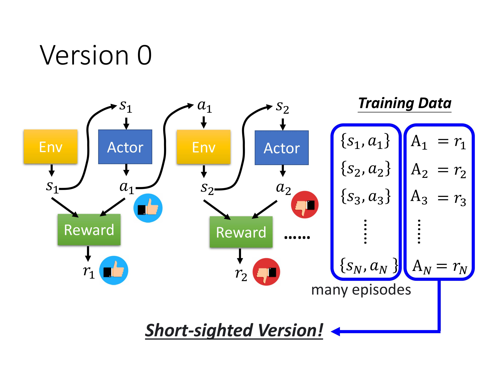

3:36    好 那我們就繼續吧 講到目前為止 你可能覺得跟 Super Vise Learning

3:42    沒有什麼不同 那確實就是沒有什麼不同 接下來真正的重點是

3:48    在我們怎麼定義 a 上面 好 那接下來的重點就是怎麼定義 a 了

3:56    那先講一個最簡單的 但是其實是不正確的版本

4:02    那這個其實也是 助教的 Sample Code 的版本 那這個不正確的版本是怎麼做的呢

4:10    這個不正確版本是這個樣子 首先我們還是需要蒐集一些訓練資料

4:17    就是需要蒐集 s 跟 a 的 Pair 怎麼蒐集這個 s 跟 a 的 Pair 呢

4:23    你需要先有一個 Actor 這個 Actor 去跟環境做互動

4:29    它就可以蒐集到 s 跟 a 的 Pair 那這個 Actor 是哪裡來的呢

4:35    你可能覺得很奇怪 我們今天的目標 不就是要訓練一個 Actor 嗎 那你又說你需要拿一個 Actor

4:40    去跟環境做互動 然後把這個 Actor 它的 s 跟 a 記錄下來 那這個 Actor 是哪裡來的呢

4:47    你先把這個 Actor 想成就是一個隨機的 Actor 好了 就它是一個

4:52    它就是一個隨機的東西 那看到 s1 然後它執行的行為就是亂七八糟的

4:58    就是隨機的 但是我們會把它在 每一個 s 執行的行為 a

5:03    通通都記錄下來 好 那通常我們在這個蒐集資料的話

5:10    你不會只把 Actor 跟環境做一個 Episode 通常會做多個 Episode

5:16    然後期待你可以蒐集到足夠的資料 比如說在助教 Sample Code裡面

5:22    可能就是跑了 5 個 Episode 然後才蒐集到足夠的資料

5:28    好 所以我們就是去觀察 某一個 Actor 它跟環境互動的狀況 那把這個 Actor

5:33    它在每一個 Observation 執行的 Action 都記錄下來

5:40    然後接下來 我們就去評價每一個 Action 它到底是好還是不好

5:46    評價完以後 我們就可以拿我們評價的結果 來訓練我們的 Actor

5:52    那怎麼評價呢 我們剛才有說 我們會用 A 這一個東西 來評價在每一個 Step

5:59    我們希不希望我們的 Actor 採取某一個行為 那最簡單的評價方式是

6:05    假設在某一個 Step s1 我們執行了 a1 然後得到 Reward r1

6:14    那 Reward 如果如果是正的 那也許就代表這個 Action 是好的

6:20    那如果 Reward 是負的 那也許就代表這個 Action 是不好的

6:25    那我們就把這個 Reward r1 r2 當做是 a A1 就是 r1

6:31    A2 就是 r2 A3 就是 r3 AN 就是 rN 那這樣等同於你就告訴 machine 說

6:38    如果我們執行完某一個 Action a1 那得到的 Reward 是正的

6:43    那這就是一個好的 Action 你以後看到 s1 就要執行 a1 如果今天在 s2 執行 a2

6:49    得到 Reward 是負的 就代表 a2 是不好的 a2 就代表所以以後看到 s2 的時候

6:56    就不要執行 a2 好 那這個

7:04    那這個 Version 0 它並不是一個好的版本

7:10    為什麼它不是一個好的版本呢 因為你用這一個方法 你把 A1 設為 r1

7:16    A2 設為 r2 這個方法認出來的 Network 它是一個短視近利的 Actor

7:23    它就是一個只知道會一時爽的 Actor 它完全沒有長程規劃的概念

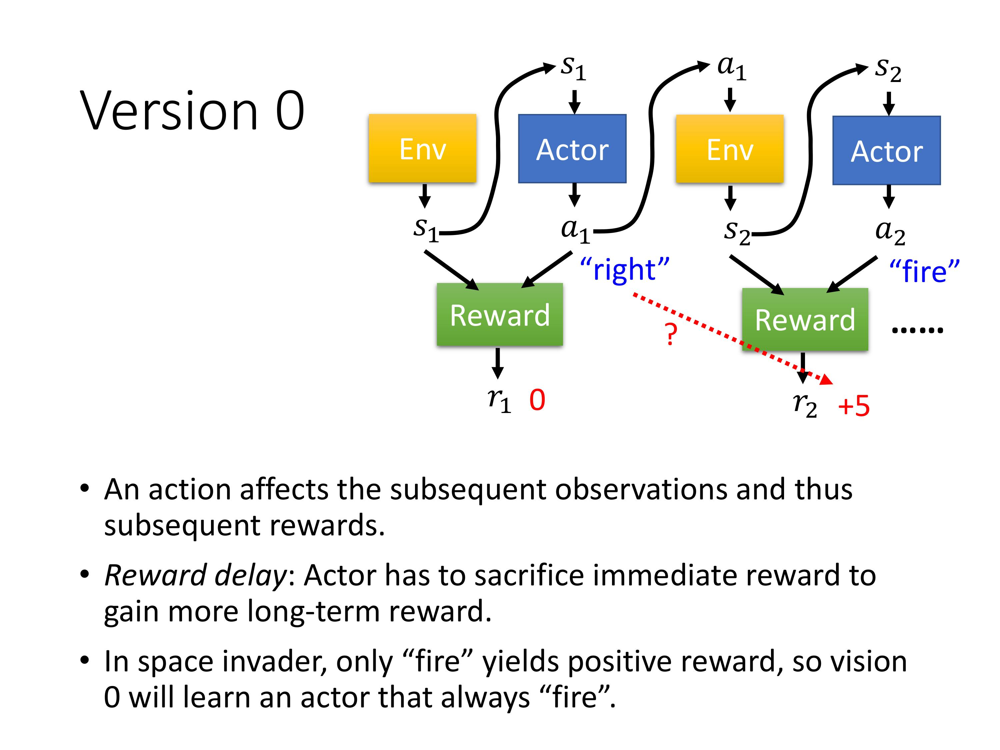

7:31    怎麼說呢 因為我們知道說每一個行為 其實都會影響互動接下來的發展

7:39    也就是說 Actor 在 s1 執行 a1 得到 r1 這個並不是互動的全部

7:46    因為 a1 影響了我們接下來會看到 s2 s2 會影響到接下來會執行 a2

7:53    也影響到接下來會產生 r2 所以 a1 也會影響到

8:00    我們會不會得到 r2 所以每一個行為並不是獨立的

8:08    每一個行為都會影響到接下來發生的事情

8:15    好 而且我們今天在跟環境做互動的時候 有一個問題叫做

8:20    Reward Delay 什麼是 Reward Delay 呢 就是有時候你需要犧牲短期的利益

8:28    以換取更長程的目標 如果在下圍棋的時候 如果你有看天龍八部的時候你就知道說

8:35    這個虛竹在破解珍瓏棋局的時候 堵死自己一塊子 讓自己被殺了很多子以後

8:41    最後反而贏了整局棋 那如果是在這個 Space Invaders 的遊戲裡面

8:47    你可能需要先左右移動一下進行瞄準 然後射擊才會得到分數

8:54    而左右移動這件事情是 沒有任何 Reward 的 左右移動這件事情得到的 Reward 是零

9:00    只有射擊才會得到 Reward 但是並不代表左右移動是不重要的

9:05    我們會先需要左右移動進行瞄準 那我們的射擊才會有效果

9:10    所以有時候我們會 需要犧牲一些近期的 Reward 而換取更長程的 Reward

9:18    所以今天假設我們用 Version 0 那會發生什麼事呢 會發生說今天 Machine

9:24    只要是採取向左跟向右 它得到的 Reward 會是 0 如果它採取開火

9:31    它得到的 Reward 就會 只有開火的時候 它得到的 Reward 才會是正的

9:38    才會是正的 那這樣 Machine 就會學到 它只有瘋狂狂開火才是對的

9:44    因為只有開火這件事才會得到 Reward 其它行為都不會得到 Reward 所以其它行為都是不被鼓勵的

9:51    只有開火這件事是被鼓勵的 那個 Version 0 就只會學到瘋狂開火而已

9:58    那 Version 0 是助教的範例程式 那這個當然也是可以執行的 那只是它的結果不會太好而已

10:05   那助教範例十 程式之所以是 Version 0 是因為 我不知道為什麼這個 Version 0 好像是大家

10:11   如果你自己在 Implement rl 的時候 你特別容易犯的錯誤 你特別容易拿自己 Implement 的時候

10:17   就直接使用 Version 0 但是得到一個很差的結果 所以接下來怎麼辦呢

10:23   我們開始正式進入 rl 的領域 真正來看 Policy Gradient 是怎麼做的

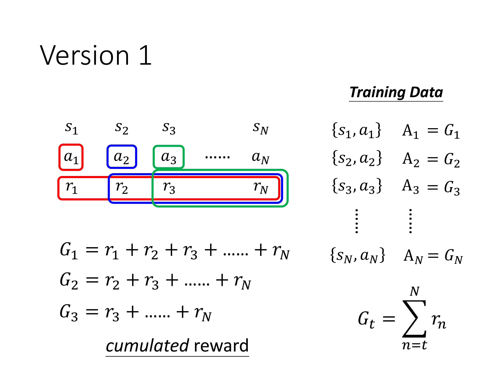

10:29   所以我們需要有 Version 1 好 在 Version 1 裡面

10:34   a1 它有多好 不是在取決於 r1 而是取決於 a1 之後所有發生的事情

10:44   我們會把 a1 執行完 a1 以後 所有得到的 Reward r1 r2 r3 到 rN

10:51   通通集合起來 通通加起來 得到一個數值叫做 G1

10:57   然後我們會說 A1 就等於 G1 我們拿這個 G1

11:03   來當作評估一個 Action 好不好的標準 剛才是直接拿 r1 來評估

11:09   現在不是 拿 G1 來評估 那接下來所有發生的 r 通通加起來

11:15   拿來評估 a1 的好壞 因為我們執行完 a1 以後 就發生這麼一連串的事情

11:20   那這麼一連串的事情加起來 也許就可以評估 a1 到底是不是一個好的 Action

11:28   所以以此類推 a2 它有多好呢 就把執行完 a2 以後 所有的 r

11:33   r2 到 rN 通通加起來得到 G2 然後那 a3 它有多好呢

11:41   就把執行完 a3 以後 所有的 r 通通加起來 就得到 G3

11:48   所以把這些東西通通都加起來 就把那這些這個 G

11:53   叫做 Cumulated 的 Reward 叫做累積的 Reward 把未來所有的 Reward 加起來

11:59   來評估一個 Action 的好壞 那像這樣子的方法聽起來就合理多了

12:04   所以這個 G 是 Cumulated 的 Reward 那 G 是什麼呢 G 就是 Gt 是什麼呢

12:10   就是從 t 這個時間點開始 我們把 rt 一直加到 rN

12:16   全部合起來就是 Cumulated 的 Reward Gt 那我們用這個 Cumulated 的 Reward

12:22   來評估一個 Action 的好壞 好 那當我們用 Cumulated 的 Reward 以後

12:28   我們就可以解決 Version 0 遇到的問題 因為你可能向右移動以後進行瞄準

12:34   接下來開火 就有打中外星人 那這樣向右這件事情 它也有 Accumulate Reward

12:41   雖然向右這件事情沒有立即的 Reward 假設 a1 是向右 那 r1 可能是 0

12:46   但接下來可能會因為向右這件事 導致有瞄準 導致有打到外星人

12:51   那 Cumulated 的 Reward 就會正的 那我們就會知道說 其實向右也是一個好的 Action

12:58   這個是 Version 1 但是你仔細想一想會發現 Version 1 好像也有點問題

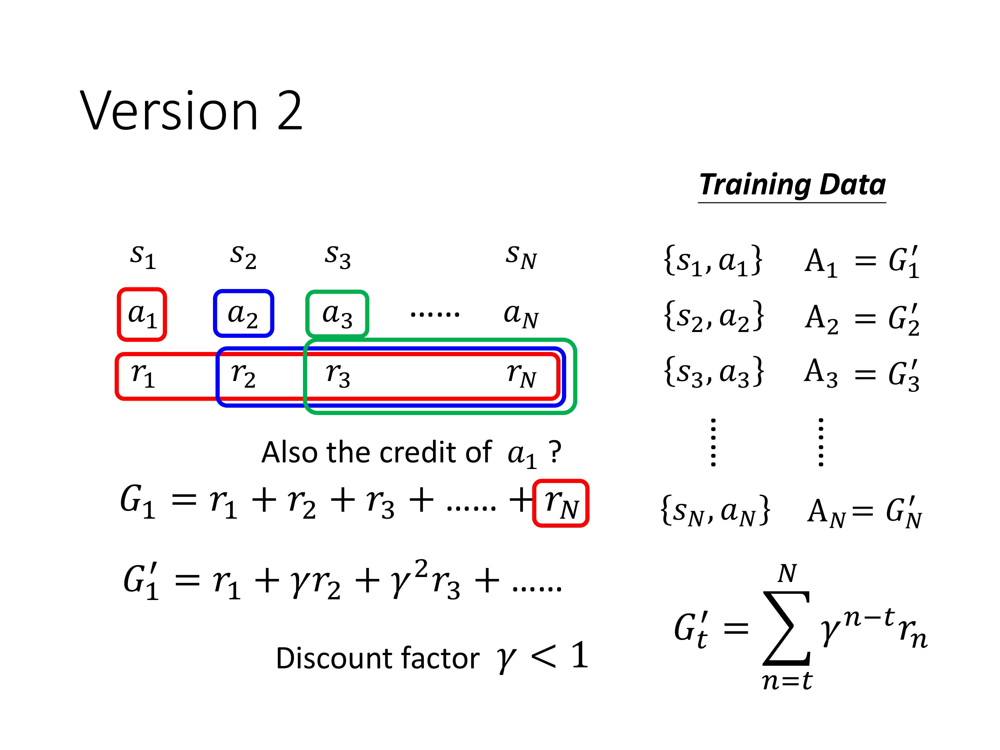

13:06   有什麼樣的問題呢 這個假設這個遊戲非常地長

13:12   你把 rN 歸功於 a1 好像不太合適吧

13:19   就是當我們採取 a1 這個行為的時候 立即有影響的是 r1 接下來有影響到 r2

13:25   接下來影響到 r3 那假設這個過程非常非常地長的話 那我們說因為有做 a1

13:32   導致我們可以得到 rN 這個可能性應該很低吧

13:37   也許得到 rN 的功勞 不應該歸功於 a1

13:44   好 所以怎麼辦呢 有第二個版本的 Cumulated 的 Reward

13:49   我們這邊用 G' 來表示 Cumulated 的 Reward

13:54   好 這個我們會在 r 前面 乘一個 Discount 的 Factor 這個 Discount 的 Factor γ

14:00   也會設一個小於 1 的值 有可能會設 比如說 0.9 或 0.99 之類的

14:06   所以這個 G'1 相較於 G1 有什麼不同呢 G1 是 r1 加 r2 加 r3

14:12   那 G'1 呢 是 r1 加 γr2 加 γ 平方 r3

14:18   就是距離採取這個 Action 越遠 我們 γ 平方項就越多

14:24   所以 r2 距離 a1 一步 就乘個 γ r3 距離 a1 兩步 就乘 γ 平方

14:30   那這樣一直加到 rN 的時候 rN 對 G'1 就幾乎沒有影響力了 因為你 γ 乘了非常非常多次了

14:37   γ 是一個小於 1 的值 就算你設 0.9 0.9 的比如說 10 次方 那其實也很小了

14:42   所以你今天用這個方法 就可以把離 a1 比較近的那些 Reward

14:48   給它比較大的權重 離我比較遠的那些 Reward 給它比較小的權重

14:53   所以我們現在有一個新的 A 這個新的 A 這個評估 這個 Action 好壞的這個 A

15:00   我們現在用 G'1 來表示它 那它的式子可以寫成這個樣子

15:05   這個 G't 就是 Summention over n 等於 t 到 N 然後我們把 rn 乘上 γ 的 n-t 次方

15:14   所以離我們現在 採取的 Action 越遠的那些 Reward 它的 γ 就被乘越多次

15:20   它對我們的 G' 的影響就越小 這是第二個版本

15:27   聽到這邊你是不是覺得合理多了呢 好 我們來看大家有沒有問題要問的

15:42   好 有同學說怎麼有點像蒙地卡羅

15:48   不錯 等一下會講到蒙地卡羅

15:56   好 這個請問一個

16:02   是一個 請問 我懂了 請問一個大括號是一個 Episode

16:08   還是這樣藍色的框住的多個大括號

16:14   是一個 Episode 好 一個大括號不是一個 Episode 一個大括號是

16:20   我們在這一個 Observation 執行這一個 Action 的時候

16:27   這個是一筆資料 它不是一個 Episode Episode 是很多的

16:33   很多次的 Observation 跟很多次的 Action 才合起來

16:38   才是一個 Episode

16:45   G1 需不需 有一個同學問說 G1 需不需要做標準化之類的動作

16:52   這個問題太棒了 為什麼呢 因為這個就是 Version 3

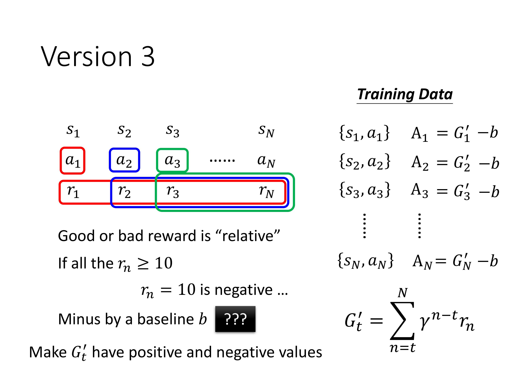

16:57   好 那我們就繼續講 Version 3 吧 還有 這邊還有一個問題是

17:05   越早的動作就會累積到越多的分數嗎

17:11   越晚的動作累積的分數就越少

17:19   好 對 沒錯 是 在這個設計的情境裡面 是 越早的動作就會累積到越多的分數

17:27   但是這個其實也是一個合理的情境 因為你想想看 比較早的那些動作對接下來的影響比較大

17:34   到遊戲的終局 沒什麼外星人可以殺了 你可能做什麼事對結果影響都不大

17:39   所以比較早的那些 Observation 它們的動作是我們可能需要特別在意的

17:46   不過像這種 A 要怎麼決定 有很多種不同的方法 如果你不想要比較早的動作 Action 比較大

17:54   你完全可以改變這個 A 的定義 事實上不同的 rl 的方法 其實就是在 A 上面下文章

18:00   有不同的定義 A 的方法

18:06   看來仍然不適合用在圍棋之類的遊戲

18:11   畢竟圍棋這種遊戲只有結尾才有分數

18:17   好 這是一個好問題 這個我們現在講的這些方法 到底能不能夠處理

18:24   這種結尾才有分數的遊戲呢 也不是不行 對不對

18:30   其實也是可以的 怎麼說呢 假設今天只有 rN 有分數

18:36   其它通通都是 0 那會發生什麼事 那會發生說

18:41   今天我們採取一連串的 Action 只要最後贏了 這一串的 Action 都是好的

18:48   如果輸了 這一連串的 Action 通通都算是不好的

18:54   而你可能會覺得這樣做 感覺 Train Network 應該會很難 Train

19:01   確實很難 Train 但是就我所知 最早的那個版本的 AlphaGo

19:06   它是這樣 Train 的 很神奇 它就是這樣做的 它裡面有用到這樣子的技術

> learning算法的显著提升，就是要搞定一个network也好model也好，能直接建模target/loss，少一点折中的trick，硬train。只要train得动，效果就会很好。

19:12   當然還有一些其它的方法 比如說 Value Network 等等 那這個等一下也會講到

19:18   那最早的 AlphaGo 它有採取這樣子的技術來做學習 它有試著採取這樣的技術 看起來是學得起來的

19:28   拿預估的誤差當 Reward

19:33   拿 有一個同學說那其實 AlphaGo 可以拿預估的誤差當 Reward

19:38   那你要有一個辦法先預估誤差 那你才拿它來當 Reward 那有沒有辦法事先預估

19:46   我們接下來會得到多少的 Reward 呢 有 那這個在之後的版本裡面

19:51   會有這樣的技術 但我目前還沒有講到那一塊

19:56   好 那我們接下來就講 Version 3 Version 3 就是像剛才同學問的

20:03   要不要做標準化呢 要 那為什麼呢 因為好或壞是相對的

20:12   好或壞是相對的 怎麼說好或壞是相對的呢 假設所有

20:18   假設今天在這個遊戲裡面 你每次採取一個行動的時候 最低分就預設是 10 分

20:26   那你其實得到 10 分的 Reward 根本算是差的 就好像說今天你說你得

20:31   在某一門課得到 60 分 這個叫做好或不好 還是不好呢 沒有人知道 因為那要看別人得到多少分數

20:39   如果別人都是 40 分 你是全班最高分 那你很厲害 如果別人都是 80 分 你是全班最低分 那就很不厲害

20:45   所以 Reward 這個東西是相對的 所以如果我們只是單純的把 G 算出來

20:52   你可能會遇到一個問題 假設這個遊戲裡面 可能永遠都是拿到正的分數

20:58   每一個行為都會給我們正的分數 只是有大有小的不同 那你這邊 G 算出來通通都會是正的

21:05   有些行為其實是不好的 但是你仍然會鼓勵你的 Model 去採取這些行為

21:11   所以怎麼辦 我們需要做一下標準化 那這邊先講一個最簡單的方法就是

21:17   把所有的 G' 都減掉一個 b 這個 b 在這邊叫做

21:24   在 rl 的文獻上通常叫做 Baseline 那這個跟我們作業的 Baseline 有點不像

21:30   但是反正在 rl 的文獻上 就叫做 Baseline 就對了 我們把所有的 G' 都減掉一個 b

21:36   目標就是讓 G' 有正有負 特別高的 G' 讓它是正的

21:42   特別低的 G' 讓它是負的 好 但是這邊會有一個問題就是

21:48   那要怎麼樣設定這個 Baseline 呢 我們怎麼設定一個好的 Baseline 讓 G' 有正有負呢

21:54   那這個我們在接下來的版本裡面還會再提到 但目前為止我們先講到這個地方

22:06   好 有一個同學說需要個比較好的 Heuristic Function 對 需要個

22:12   就是說在下圍棋的時候 假設今天你的 Reward 非常地 Sparse 那你可能會需要一個好的

22:18   Heuristic Function 如果你有看過那個最原始的 那個深藍的那篇 Paper 就是在這個機器下圍棋打爆人類之前

22:27   其實已經在西洋棋上打爆人類了 那個就叫深藍 深藍就有蠻多 Heuristic 的 Function

22:34   它就不是只有下到遊戲的中盤 才知道 才得到 Reward 中間會有蠻多的狀況它都會得到 Reward

22:44   好 那接下來 剛才講的是大概念

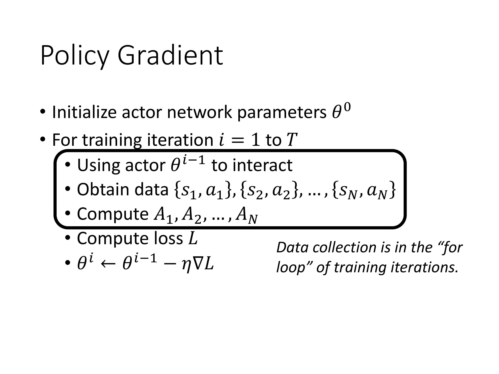

22:49   接下來就會實際告訴你說 Policy Gradient 是怎麼操作的

22:54   那你可以仔細讀一下助教的程式 助教就是這麼操作的 首先你要先 Random 初始化

23:02   隨機初始化你的 Actor 你就給你的 Actor 一個隨機初始化的參數

23:08   叫做 θ0 然後接下來你進入你的 Training Iteration

23:14   假設你要跑 T 個 Training Iteration 好 那你就拿你的這個

23:20   現在手上有的 Actor 一開始是這個 θ0 一開始很笨 它什麼都不會 它採取的行為都是隨機的

23:27   但它會越來越好 你拿你的 Actor 去跟環境做互動 那你就得到一大堆的 s 跟 a

23:34   你就得到一大堆的 s 跟 a 就把它互動的過程記錄下來 得到這些 s 跟 a

23:39   那接下來你就要進行評價 你用 A1 到 AN 來決定說 這些 Action 到底是好還是不好

23:48   你先拿你的 Actor 去跟環境做互動 蒐集到這些觀察 接下來你要進行評價 看這些 Action 是好的還是不好的

23:55   那你真正需要這個在意的地方 你最需要把它改動的地方

24:00   就是在評價這個過程裡面 那助教程式這個 A 就直接設成 Immediate Reward

24:05   那你寫的要改這一段 你才有可能得到好的結果 好 設完這個 A 以後

24:11   就結束了 就結束了 你就把 Loss 定義出來 然後 Update 你的 Model

24:17   這個 Update 的過程 就跟 Gradient Descent 一模一樣的 會去計算 L 的 Gradient

24:22   前面乘上 Learning Rate 然後拿這個 Gradient 去 Update 你的 Model

24:27   就把 θi-1 Update 成 θi 但是這邊有一個神奇的地方是

24:35   一般的 training 在我們到目前為止的 Training Data Collection 都是在 For 迴圈之外

24:43   比如說我有一堆資料 然後把這堆資料拿來做 Training 拿來 Update

24:48   Model 很多次 然後最後得到一個收斂的參數 然後拿這個參數來做 Testing

24:54   但在 RL 裡面不是這樣 你發現蒐集資料這一段

25:00   居然是在 For 迴圈裡面 假設這個 For 迴圈 你打算跑 400 次

25:07   那你就得蒐集資料 400 次 或者是我們用一個圖像化的方式來表示

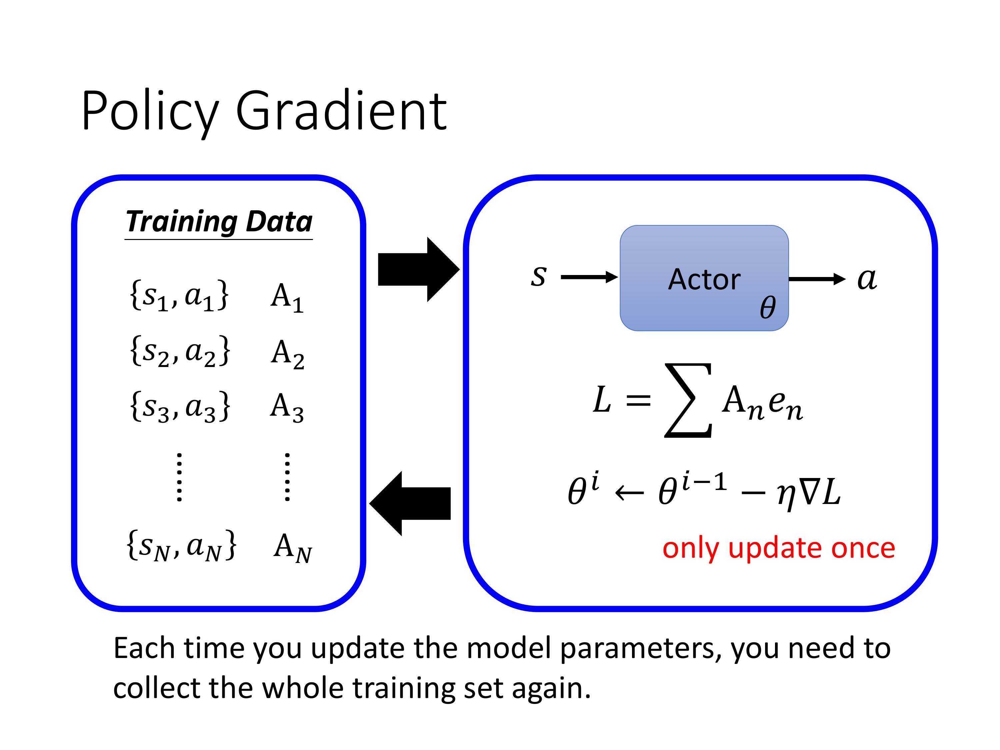

25:14   這個是你蒐集到的資料 就是你觀察了某一個 Actor

25:19   它在每一個 State 執行的 Action 然後接下來你給予一個評價 但要用什麼評價 要用哪一個版本

25:26   這個是你自己決定的 你給予一個評價 說每一個 Action 是好或不好 你有了這些資料 這些評價以後

25:34   拿去訓練你的 Actor 你拿這些評價可以定義出一個 Loss

25:39   然後你可以更新你的參數一次 但是有趣的地方是 你只能更新一次而已

25:47   一旦更新完一次參數以後 接下來你就要重新去蒐集資料了

25:54   登記一次參數以後 你就要重新蒐集資料 才能更新下一次參數

26:01   所以這就是為什麼 RL 往往它的訓練過程非常花時間

26:06   蒐集資料這件事情 居然是在 For 迴圈裡面的 你每次 Update 完一次參數以後

26:13   你的資料就要重新再蒐集一次 再去 Update 參數 然後 Update 完一次以後

26:18   又要再重新蒐集資料 如果你參數要 Update 400 次 那你資料就要蒐集 400 次

26:24   那這個過程顯然非常地花時間 那你接下來就會問說

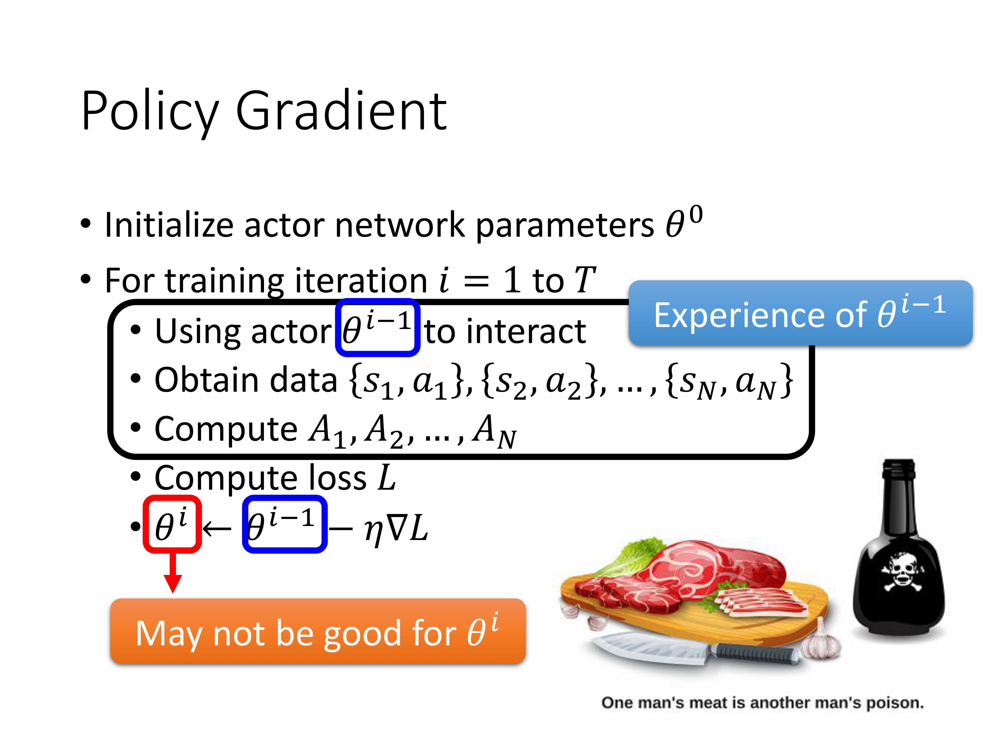

26:31   那為什麼會這樣呢 為什麼我們不能夠一組資料 就拿來 Update 模型 Update 400 次

26:38   然後就結束了呢 為什麼每次 Update 完我們的模型參數以後 Update Network 參數以後

26:44   就要重新再蒐集資料呢 那我們 那這邊一個比較簡單的比喻是

26:51   你知道一個人的食物 可能是另外一個人的毒藥

26:57   這些資料是由 θi-1 所蒐集出來的

27:02   這是 θi-1 跟環境互動的結果 這個是 θi-1 的經驗

27:09   這些經驗可以拿來更新 θi-1 可以拿來 Update θi-1 的參數

27:16   但它不一定適合拿來 Update θi 的參數

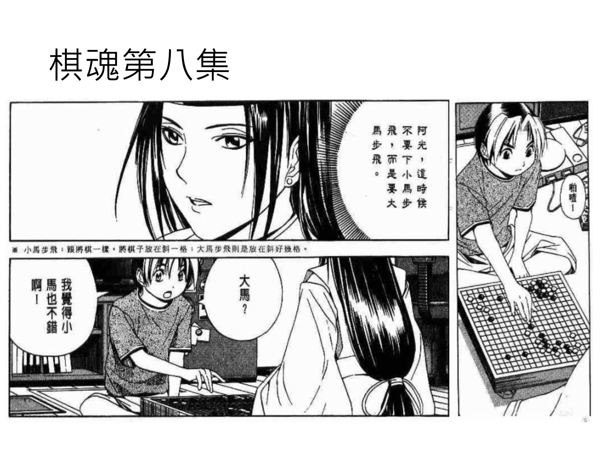

27:22   或者是我們舉一個具體的例子 這個例子來自棋魂的第八集 大家看過棋魂吧

27:28   我應該就不需要解釋棋魂的劇情了吧 這個是進藤光 然後他在跟佐為下棋

27:36   然後進藤光就下一步 在大馬 現在在小馬步飛

27:42   這小馬步飛具體是什麼 我其實也沒有非常地確定 但這邊有解釋一下 就是棋子斜放一格叫做小馬步飛

27:49   斜放好幾格叫做大馬步飛 好 阿光下完棋以後 佐為就說這個時候不要下小馬步飛

27:57   而是要下大馬步飛 然後阿光說為什麼要下大馬步飛呢

28:03   我覺得小馬步飛也不錯 這個時候佐為就解釋了

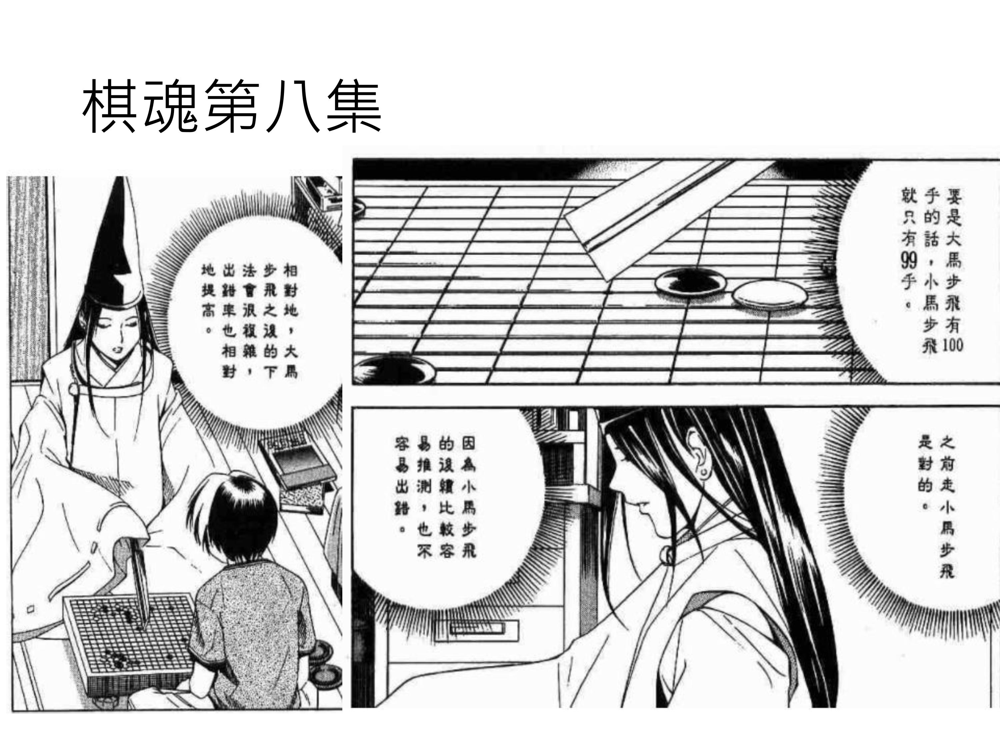

28:08   如果大馬步飛有 100 手的話 小馬步飛只有 99 手

28:13   接下來是重點 之前走小馬步飛是對的 因為小馬步飛的後續比較容易預測

28:21   也比較不容易出錯 但是大馬步飛的下法會比較複雜

28:27   但是阿光假設想要變強的話 他應該要學習下大馬步飛 或者是阿光變得比較強以後

28:33   他應該要下大馬步飛 所以你知道說同樣的一個行為

28:39   同樣是做下小馬步飛這件事 對不同棋力的棋士來說

28:46   也許它的好是不一樣的 對於比較弱的阿光來說 下小馬步飛是對的

28:54   因為他比較不容易出錯 但對於已經變強的阿光來說 應該要下大馬步飛比較好

29:00   下小馬步飛反而是比較不好的 所以同一個 Action 同一個行為

29:08   對於不同的 Actor 而言 它的好是不一樣的

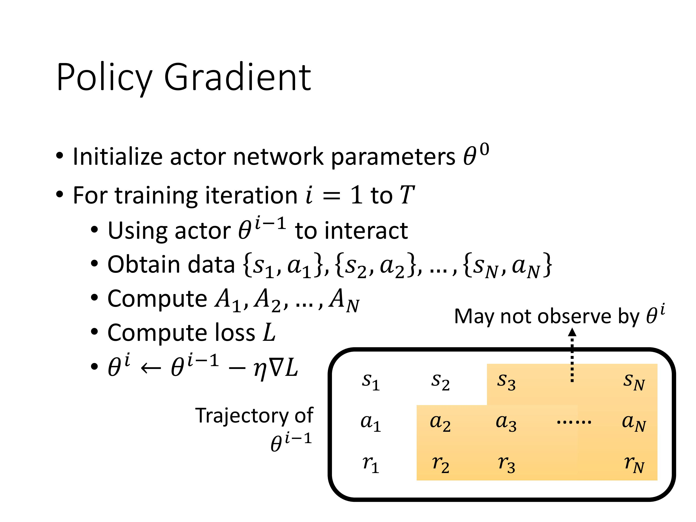

29:14   所以今天假設我們用 θi-1 蒐集了一堆的資料

29:21   這個是 θi-1 的 Trajectory 這些資料只能拿來訓練 θi-1

29:29   你不能拿這些資料來訓練 θi 為什麼不能拿這些資料來訓練 θi 呢

29:37   因為假設 假設就算是從 θi-1 跟 θi

29:42   它們在 s1 都會採取 a1 好了 但之後到了 s2 以後

29:47   它們可能採取的行為就不一樣了 所以假設對 θ 假設今天 θi

29:54   它是看 θi-1 的這個 Trajectory 那 θi-1 會執行的這個 Trajectory

30:01   跟 θi 它會採取的行為根本就不一樣 所以你拿著 θi-1 接下來會得到的 Reward

30:08   來評估 θi 接下來會得到的 Reward 其實是不合適的

30:13   所以如果再回到剛才棋魂的那個例子 同樣是假設這個 a1 就是下小馬步飛

30:21   那對於變強以前的阿光 這是一個合適的走法

30:26   但是對於變強以後的阿光 它可能就不是一個合適的走法

30:32   所以今天我們在蒐集資料 來訓練你的 Actor 的時候 你要注意就是蒐集資料的那個 Actor

30:41   要跟被訓練的那個 Actor 最好就是同一個

30:46   那當你的 Actor 更新以後 你就最好要重新去蒐集資料

30:52   這就是為什麼 Gradient Descent 它非常花時間的原因 好 我們來看一下同學有沒有問題想問的

31:02   看一下 第一手天元 5-5 很好 很好

31:07   其實第一手要下 5-5 第二手天元 第三手 5-5 然後大家就會非常地意外

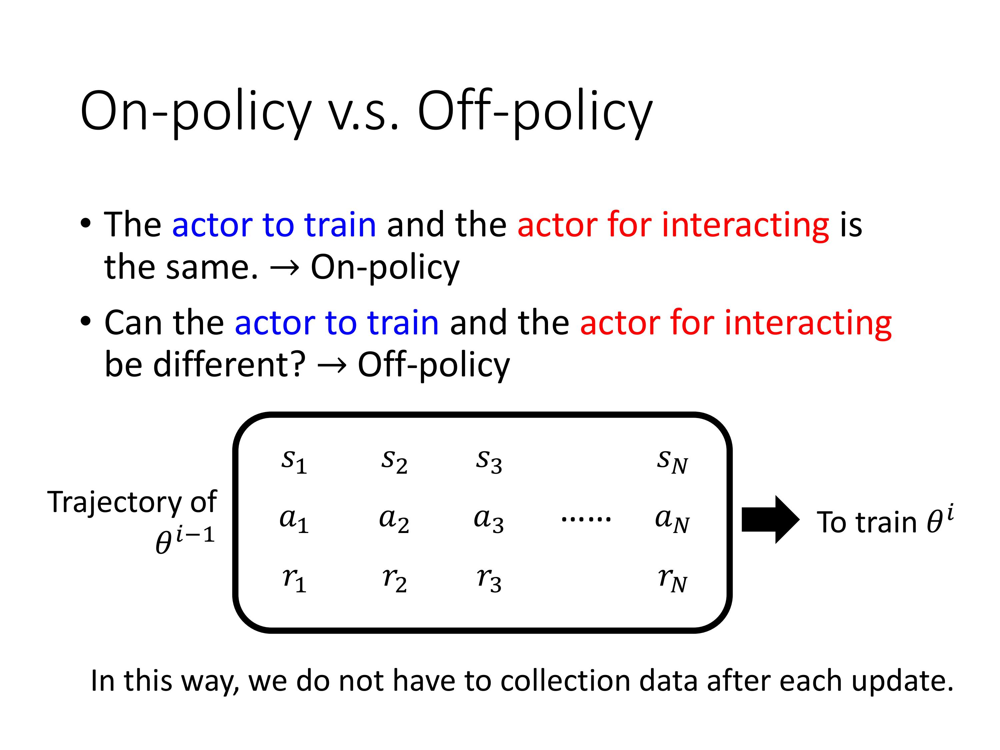

31:14   好 那如果大家暫時沒有問題的話 那我們就繼續 剛才我們說

31:20   這個要被訓練的 Actor 跟要拿來跟環境互動的 Actor

31:26   最好是同一個 當我們訓練的 Actor 跟互動的 Actor 是同一個的時候

31:32   這種叫做 On-policy 的 Learning 那我們剛才示範的那個

31:37   Policy Gradient 的整個 Algorithm 它就是 On-policy 的 Learning

31:44   那但是還有另外一種狀況叫做 Off-policy 的 Learning Off-policy 的 Learning 我們今天就不會細講

31:50   Off-policy 的 Learning 期待能夠做到的事情是 我們能不能夠讓要訓練的那個 Actor

31:57   還有跟環境互動的那個 Actor 是分開的兩個 Actor 呢

32:03   我們要訓練的 Actor 能不能夠根據其他 Actor 跟環境互動的經驗

32:08   來進行學習呢 那 Off-policy 有什麼好處呢 有一個非常顯而易見的好處

32:14   我們剛才說 θi-1 蒐集到的這些資料 不能拿來訓練 θi

32:20   如果你是 On-policy 的 Learning 的話 但是有一些比較特別的方法

32:25   它是 Off-policy 的 Learning 它可以想辦法讓 θi 去根據 θi-1 所蒐集的資料來進行學習

32:35   雖然 θi 跟 θi-1 它們是不一樣的 它們能力是不一樣的 但是我們可以用一些方法

32:40   來讓 θi 可以根據 θi-1 所蒐集到的資料 所蒐集到的互動的結果

32:47   進行學習 那這樣的好處就是 你就不用一直蒐集資料了 剛才說 Reinforcement Learning

32:53   一個很卡的地方就是 每次更新一次參數就要蒐集一次資料 你看助教的示範歷程是更新 400 次參數

33:00   400 次參數相較於你之前 Train 的 Network 沒有很多 但我們要蒐集 400 次資料 跑起來也已經是很卡了

33:07   那如果我們可以蒐一次資料 就 Update 參數很多次 這樣不是很好嗎

33:12   所以 Off-policy 它有不錯的優勢 但是 Off-policy 要怎麼做呢

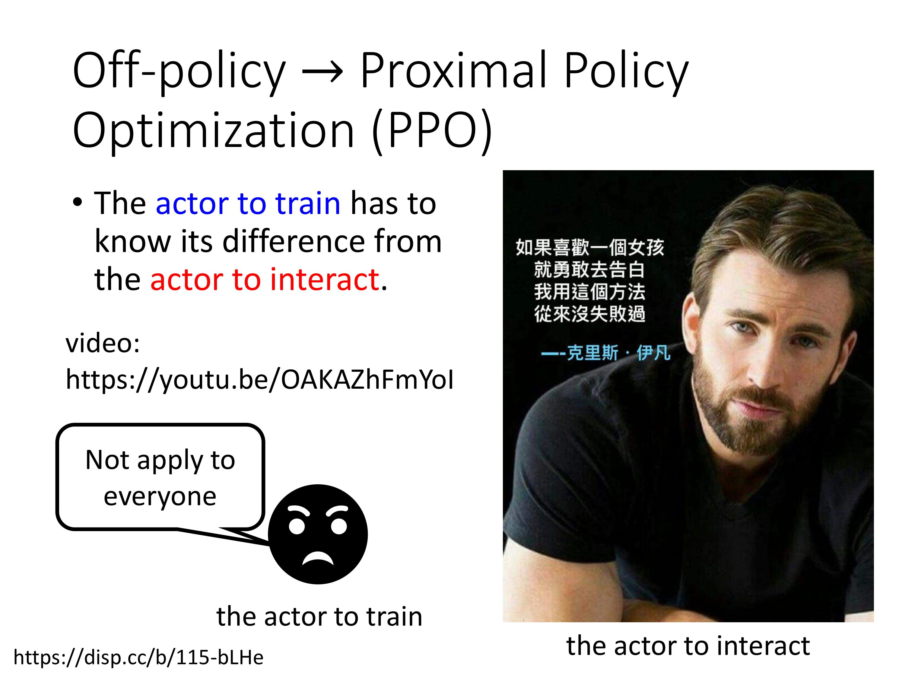

33:18   我們這邊就不細講 有一個非常經典的 Off-policy 的方法 叫做 Proximal Policy Optimization

33:25   縮寫是 PPO 那這個是今天蠻常使用的一個方法

33:30   它也是一個蠻強的方法 蠻常使用的方法 好 那今天這個 Off-policy 的重點是什麼呢

33:36   Off-policy 的重點就是 你在訓練的那個 Network 要知道自己跟別人之間的差距

33:44   它要有意識的知道說 它跟環境互動的那個 Actor 是不一樣的

33:51   那至於細節我們就不細講 那我有留那個上課的錄影的連結

33:57   在投影片的下方 等一下大家如果有興趣的話 再自己去研究 PPO 那如果要舉個比喻的話

34:03   就好像是你去問克里斯伊凡 就是美國隊長 怎麼追一個女生

34:09   然後克里斯伊凡就告訴你說 他就示範給你看 他就是 Actor To Interact

34:14   他就是負責去示範的那個 Actor 他說他只要去告白 從來沒有失敗過

34:19   但是你要知道說 你跟克里斯伊凡其實還是不一樣 人帥吃草 人醜

34:25   人帥 不是人帥吃草 人帥真好 人醜吃草 你跟克里斯伊凡是不一樣的

34:31   所以克里斯伊凡可以採取的招數 你不一定能夠採取 你可能要打一個折扣

34:38   那這個就是 Off-policy 的精神 你的 Actor To Train 要知道 Actor To Interact

34:47   跟它是不一樣的 所以 Actor To Interact 示範的那些經驗 有些可以採納

34:53   有些不一定可以採納 至於細節怎麼做 那過去的上課錄影留在這邊

34:59   給大家參考 好 那還有另外一個很重要的概念

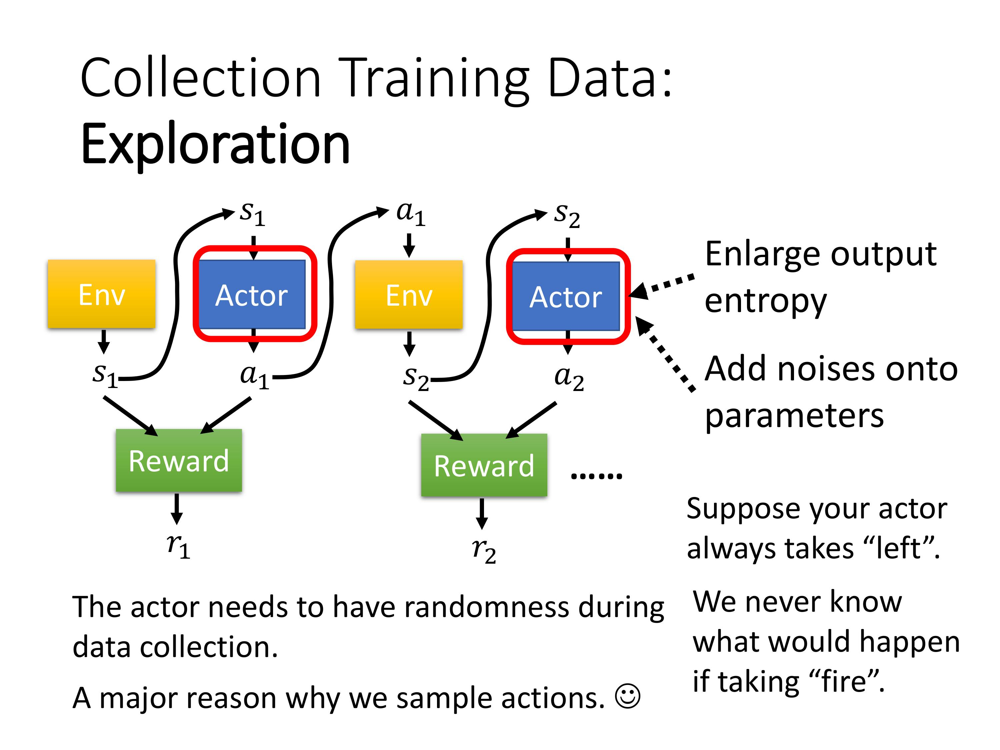

35:05   叫做 Exploration Exploration 指的是什麼呢

35:11   我們剛才有講過說 我們今天的 我們今天的這個 Actor 它在採取行為的時候

35:17   它是有一些隨機性的 而這個隨機性其實非常地重要

35:24   很多時候你隨機性不夠 你會 Train 不起來 為什麼呢

35:30   舉一個最簡單的例子 假設你一開始初始的 Actor 它永遠都只會向右移動

35:38   它從來都不會知道要開火 如果它從來沒有採取開火這個行為

35:44   你就永遠不知道開火這件事情 到底是好還是不好

35:50   唯有今天某一個 Actor 去試圖做開火這件事得到 Reward 你才有辦法去評估這個行為好或不好

35:57   假設有一些 Action 從來沒被執行過 那你根本就無從知道 這個 Action 好或不好

36:05   所以你今天在訓練的過程中 這個拿去跟環境的互動的這個 Actor

36:10   它本身的隨機性是非常重要的 你其實會期待說跟環境互動的這個 Actor

36:16   它的隨機性可以大一點 這樣我們才能夠蒐集到 比較多的 比較豐富的資料

36:23   才不會有一些狀況 它的 Reward 是從來不知道 那為了要讓這個 Actor 的隨機性大一點

36:30   甚至你在 Training 的時候 你會刻意加大它的隨機性 比如說 Actor 的 Output

36:35   不是一個 Distribution 嗎 有人會刻意加大 那個 Distribution 的 Entropy

36:41   那讓它在訓練的時候 比較容易 Sample 到那些機率比較低的行為

36:46   或者是有人會直接在這個 Actor 它的那個參數上面加 Noise 直接在 Actor 參數上加 Noise

36:53   讓它每一次採取的行為都不一樣 好 那這個就是 Exploration

37:00   那 Exploration 其實也是 RL Training 的過程中 一個非常重要的技巧 如果你在訓練過程中

37:05   你沒有讓 Network 盡量去試不同的 Action 你很有可能你會 Train 不出好的結果

37:12   好 那我們來看一下 其實這個 PPO 這個方法 DeepMind 跟 Open AI

37:18   都同時提出了 PPO 的想法 那我們來看一下 DeepMind 的 PPO 的 Demo 的影片

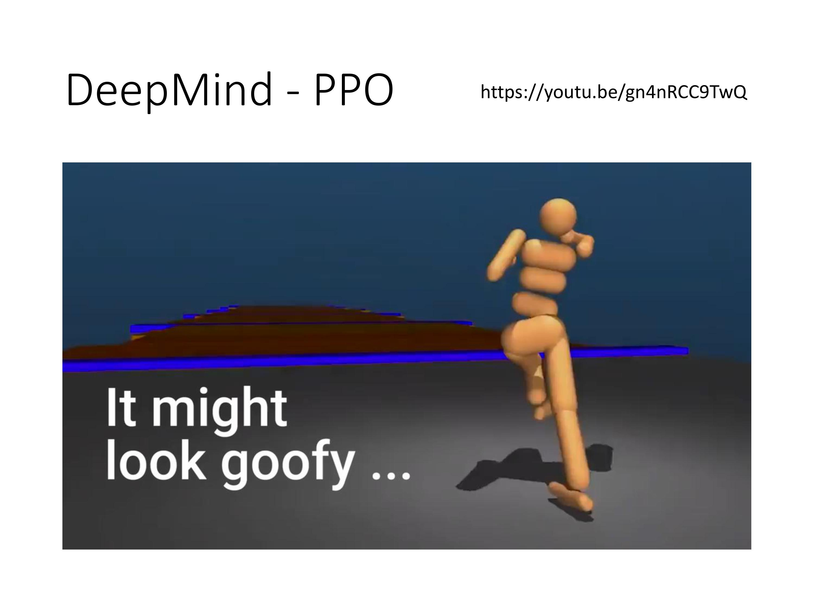

37:25   它看起來是這樣子的

39:16   好 那這個是 DeepMind 的 PPO 那就是可以用 PPO 這個方法

39:21   用這個 Reinforcement Learning 的方法 去 Learn 什麼 蜘蛛型的機器人或人形的機器人

39:29   做一些動作 比如說跑起來 或者是蹦跳 或者是跨過圍牆等等

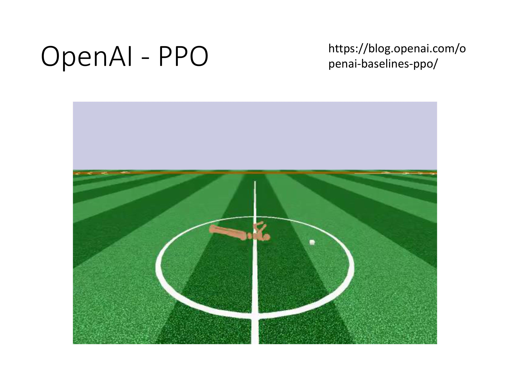

39:35   好 那接下來是 OpenAI 的 PPO 它這個影片就沒有剛才那個潮

39:41   它沒有那個配音 不過我幫它配個音好了 這個影片我叫它 修機器學習的你

39:50   好 我修了一門課叫做機器學習 但在這門課裡面 有非常多的障礙 我一直遇到挫折

39:59   那個紅色的球是 Baseline 而這個 Baseline 一個接一個

40:04   永遠都不會停止 然後我 Train 一個 Network 很久

40:09   我 collate 它就掉線啦 Train 了三個小時的 Model 不見

40:15   但我仍然是爬起來繼續地向前 我想開一個比較大的模型

40:20   看看可不可以 Train 得比較好一點 但是結果發生什麼事情呢 Out Of Memory

40:27   那個圈圈一直在轉 它就是不跑 怎麼辦

40:33   但我還是爬起來 繼續向前 結果 Private Set 跟 Public Set 結果不一樣

40:38   真的是讓人覺得非常地生氣 這個影片到這邊就結束了嗎 沒關係 我們最後還是要給它一個正面的結尾

40:45   就算是遭遇到這麼多挫折 我仍然努力向前好好地學習

40:51   這個就是 PPO 好 那講到這邊正好告一個段落

40:57   那其他的部分我們就 只好下週再講 那其實到目前為止講的東西

41:05   其實做作業也算是蠻足夠的 好 那今天就感謝大家線上收聽

41:12   那正好已經快到六點